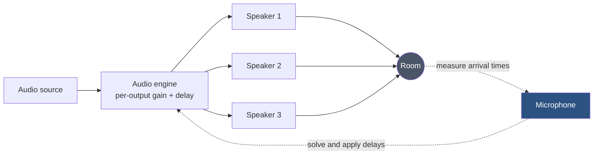
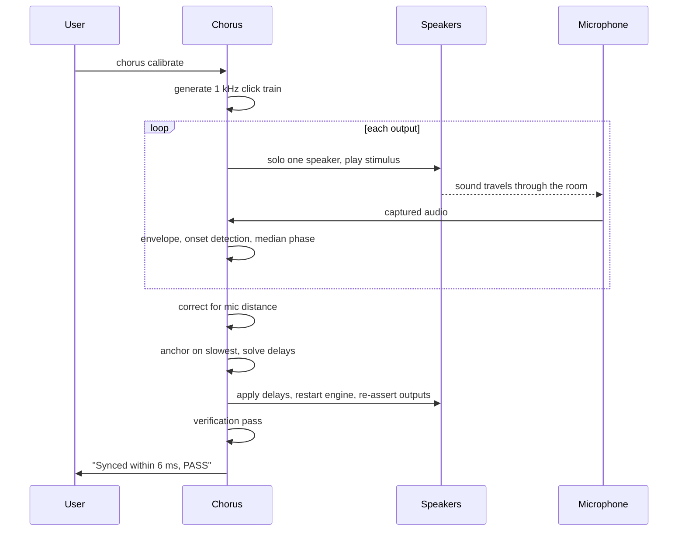

# Chorus

**Play one audio source through several speakers at once, and actually get them in sync.**

Chorus turns a Windows PC into a multi-output audio hub for mismatched Bluetooth speakers, a Miracast tablet, HDMI, and anything else Windows can play to. Its distinguishing feature is that it **measures the timing offset between your speakers with a microphone and corrects it automatically**, instead of leaving you dragging a delay slider by ear.

> **Status: work in progress (v0.1).** The routing, control panel, mode switching and persistence work. Automatic calibration is being built. Capacity figures are being measured. Nothing here is claimed that has not been tested, see [Measured Limits](#measured-limits).

---

## The problem

You own several Bluetooth speakers bought at different times. You would like them to play together.

- They **cannot pair with each other**, manufacturer TWS pairing only links identical models.
- **Auracast is not an option** unless every speaker has Bluetooth LE Audio hardware.
- **Phone dual-audio produces an echo** and gives you no way to correct it.
- **Desktop routing tools** can send audio to several devices, but leave the timing to you.

That last point is the real problem. Every Bluetooth speaker adds its own 150-250 ms of latency, and no two agree. The result is a flam or an echo. Worse, the human ear is bad at telling you *which* speaker is early, so tuning by ear is blind guesswork.

Chorus closes the loop with a microphone.



Play a click train through one speaker at a time, record it, detect the onsets, compute each speaker's real latency, then delay every faster speaker to match the slowest. Sixty seconds, and the echo is gone.

---

## Measured limits

Read this before you plan a build. These numbers are honest, and where something is untested it says so.

| Constraint | Value | Basis |
|---|---|---|
| Bluetooth adapters usable on Windows | **1**, extra USB dongles are not used concurrently | Vendor documentation |
| Bandwidth per Bluetooth audio stream | ~345 kbps | Cited |
| Concurrent Bluetooth speakers, Intel 8260 | **2 verified** | Measured |
| Concurrent Bluetooth speakers, 3 or more | **Untested** | Pending |
| Outputs across mixed transports | 5 buses (Bluetooth + Miracast + HDMI + analog) | Measured |
| Achievable sync | ≤ 10 ms residual spread (target) | Design target |

**Bluetooth speaker count is bounded by your adapter, not by Chorus.** More than two Bluetooth speakers on one Windows machine is not currently a claim this project makes. If you need many speakers, mix transports, or follow the Linux path on the roadmap where BlueZ can drive several adapters at once.

---

## Documentation

**Building it yourself**

| Document | Contents |
|---|---|
| [REPRODUCE.md](REPRODUCE.md) | Step by step build from an empty machine, with a verification checklist |
| [Build Notes](docs/BUILD-NOTES.md) | Every problem hit during development, how it was diagnosed, and what fixed it |

**Design**

| Document | Contents |
|---|---|
| [Product Requirements](docs/PRD.md) | Problem, users, requirements, success metrics, roadmap, competitive landscape |
| [Technical Requirements](docs/TRD.md) | Architecture, transport constraints, engine integration contract, calibration algorithm, test plan |
| [UI Flow](docs/UI-FLOW.md) | Surfaces, wireframes, calibration wizard, CLI reference |
| [Backend Schema](docs/SCHEMA.md) | Config and profile schemas, validation rules, reconciliation, migrations |
| [User Manual](docs/USER-MANUAL.md) | Installation, calibration walkthrough, troubleshooting, FAQ |

Every document is also available as Word in [docs/word/](docs/word/), with the diagrams rasterised.

To build it, start with [REPRODUCE.md](REPRODUCE.md). To understand how it works, read the [TRD](docs/TRD.md). To use it, read the [User Manual](docs/USER-MANUAL.md).

---

## Quick start

> **What exists today.** The routing, mode switching, volume panel and repair tooling work and are in `scripts/`. The `chorus` CLI shown in the design documents is specified but **not yet built**. [REPRODUCE.md](REPRODUCE.md) is explicit about which is which.

Install Voicemeeter Potato and reboot, then:

```powershell
.\scriptsix-speakers.ps1      # assign every speaker to a bus, verified
.\scripts\master-volume.ps1     # floating master and per speaker volume
.\scripts\speaker-mode.ps1 theatre   # all speakers, or: partypal / stone / laptop / tab
.\scripts	une-delay.ps1 A1 42  # apply a measured delay to one output
```

Full walkthrough with prerequisites and a verification checklist: [REPRODUCE.md](REPRODUCE.md).

---

## How calibration works



Full specification, including the stimulus design, aliasing constraints and precision limits, is in [TRD §6](docs/TRD.md#6-calibration-engine).

---

## Roadmap

| Version | Scope | State |
|---|---|---|
| v0.1 | Routing, modes, volume panel, persistence, manual delay | In progress |
| v0.2 | Automatic mic calibration with verification | In progress |
| v0.3 | Measured capacity discovery, diagnostics, distance compensation | Planned |
| v0.4 | Mixed-transport calibration profiles | Planned |
| v1.0 | Installer, complete docs, support bundles | Planned |
| Later | Linux/BlueZ backend, multiple adapters, more speakers | Under consideration |

---

## Prior art

Chorus stands on other people's work, and the routing problem is well covered already. What is missing elsewhere is acoustic calibration, which is why this exists.

| Project | What it does |
|---|---|
| [Soundsync](https://github.com/geekuillaume/soundsync) | Network audio distribution across devices in a home |
| [sendspin-bt-bridge](https://github.com/trudenboy/sendspin-bt-bridge) | Multi-room Bluetooth with Home Assistant integration |
| [multi-blue](https://github.com/Dannymo11/multi-blue) | Low-latency audio to multiple Bluetooth devices |
| [SyncWave](https://github.com/CodeWithDevesh/SyncWave) | CLI for simultaneous playback to multiple Windows devices |
| [Voicemeeter](https://vb-audio.com/Voicemeeter/) | The virtual mixer Chorus drives. Not affiliated |

If you want network multi-room, use Soundsync. If you want Home Assistant integration, use sendspin-bt-bridge. Use Chorus when your speakers are out of sync and you want a number rather than a guess.

---

## Contributing

The most valuable contribution right now is **data**. If you run Chorus, please open an issue with:

- Your Bluetooth adapter model
- How many speakers you got working simultaneously, and their transports
- The output of `chorus diagnose`

The central open question of this project is how many concurrent Bluetooth audio streams real adapters sustain. Published answers are inconsistent, and most confuse *pairing* capacity with *streaming* capacity. Measured reports move that forward.

---

## Licence

MIT. See [LICENSE](LICENSE).

Voicemeeter is donationware by VB-Audio and is not distributed with this project; the installer fetches it from the vendor.
