# How Chorus Works: A Visual Guide

This document explains the system in diagrams, starting from the problem and working down to the mechanism. It is written for someone meeting the project for the first time, so it assumes no prior knowledge of Bluetooth audio, Voicemeeter, or signal processing.

If you only read one section, read [the problem in one picture](#1-the-problem-in-one-picture). Everything else follows from it.

---

## Contents

1. [The problem in one picture](#1-the-problem-in-one-picture)
2. [What calibration actually changes](#2-what-calibration-actually-changes)
3. [The system stack](#3-the-system-stack)
4. [Where the milliseconds go](#4-where-the-milliseconds-go)
5. [The signal path in detail](#5-the-signal-path-in-detail)
6. [Why only two Bluetooth speakers](#6-why-only-two-bluetooth-speakers)
7. [The radio contention problem](#7-the-radio-contention-problem)
8. [Choosing a transport](#8-choosing-a-transport)
9. [How the measurement works](#9-how-the-measurement-works)
10. [Solving for the delays](#10-solving-for-the-delays)
11. [The full calibration sequence](#11-the-full-calibration-sequence)
12. [What can go wrong at runtime](#12-what-can-go-wrong-at-runtime)
13. [Troubleshooting as a decision tree](#13-troubleshooting-as-a-decision-tree)

---

## 1. The problem in one picture

You press play. Both speakers receive the same audio at the same instant. They do **not** produce sound at the same instant.

```mermaid
gantt
    title Uncalibrated: one drum hit, two arrival times
    dateFormat SSS
    axisFormat %L ms
    todayMarker off

    section PC
    Audio sample leaves the PC        :milestone, src, 000, 0ms

    section PartyPal 185
    Encode, transmit, decode, amplify  :done, pp, 000, 176ms
    SOUND ARRIVES                      :milestone, crit, ppa, 176, 0ms

    section Stone 1400
    Encode, transmit, decode, amplify  :active, st, 000, 218ms
    SOUND ARRIVES                      :milestone, crit, sta, 218, 0ms
```

The two speakers are **42 ms apart**. That gap is what you hear as a doubled attack on drums, or a hollow echo on dialogue.

Why does it happen? Each speaker runs its own encoder, its own radio buffer, its own decoder, and its own amplifier. None of that is synchronised between manufacturers, or even between two models from the same manufacturer. The delay is a property of the specific speaker, and there is no standard that makes them agree.

| Gap between speakers | What you hear |
|---|---|
| 0 to 10 ms | One sound. Correct. |
| 10 to 25 ms | Slightly wider, mild hollowness. Usually fine. |
| 25 to 50 ms | A distinct doubled hit on percussion. This example sits here. |
| Over 50 ms | Obvious echo. Unusable. |

**The cruel part:** your ear can tell that something is wrong, but it cannot tell you *which speaker is early*. Below about 30 ms, human hearing fuses the two sounds and discards the ordering. That is why dragging a delay slider by ear turns into blind guesswork, and it is the reason this project exists.

---

## 2. What calibration actually changes

Chorus measures both arrival times, then holds the faster speaker back so both land together.

```mermaid
gantt
    title Calibrated: the fast speaker is delayed to meet the slow one
    dateFormat SSS
    axisFormat %L ms
    todayMarker off

    section PC
    Audio sample leaves the PC         :milestone, src2, 000, 0ms

    section PartyPal 185
    Chorus holds it back 42 ms         :crit, hold, 000, 42ms
    Encode, transmit, decode, amplify  :done, pp2, 042, 176ms
    SOUND ARRIVES                      :milestone, crit, ppa2, 218, 0ms

    section Stone 1400
    Encode, transmit, decode, amplify  :active, st2, 000, 218ms
    SOUND ARRIVES                      :milestone, crit, sta2, 218, 0ms
```

Both now arrive at 218 ms. The echo is gone.

Two things follow from this picture, and they are the most commonly misunderstood parts of the project:

**Chorus does not make Bluetooth faster.** Everything still arrives 218 ms late. Absolute latency is a property of the transport and cannot be removed. What matters perceptually is only the *difference* between speakers, and that is what gets fixed.

**Delay can only be added, never removed.** There is no way to make the Stone arrive sooner, so the slowest speaker sets the pace and everything faster is held back to meet it. The slowest output always receives a delay of zero. This is why calibration appears to "only change one speaker".

---

## 3. The system stack

Audio does not go from your player to your speaker directly. It passes through five layers, and Chorus operates at exactly one of them.

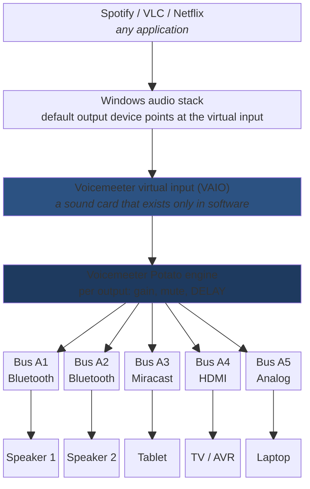

The key idea is the **virtual input**. Voicemeeter installs a device that Windows believes is a sound card. Applications play to it normally, with no special support required. Instead of driving a physical speaker, that device hands the audio to the Voicemeeter engine, which can then copy it to five real outputs at once and apply an independent delay to each.

Chorus is the control layer that drives the engine, measures the result, and computes the delays. It is not itself in the audio path.

---

## 4. Where the milliseconds go

The 218 ms is not one thing. It accumulates across the whole chain.

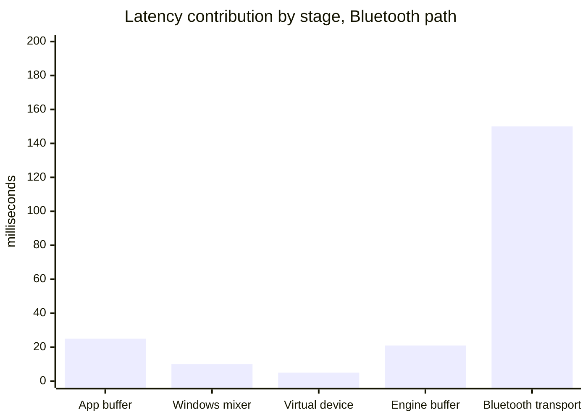

| Stage | Typical | Can Chorus change it? |
|---|---|---|
| Application buffer | 10 to 40 ms | No |
| Windows shared mixer | about 10 ms | No |
| Virtual device to engine | about 5 ms | No |
| Engine output buffer | 11, 21 or 43 ms | **Yes**, this is the buffer size setting |
| Bluetooth encode, transmit, decode, amplify | 100 to 200 ms | No |

Only one bar is under our control, and increasing it is often the right move. A larger buffer holds more audio in reserve, which lets playback ride through brief radio interference instead of dropping out.

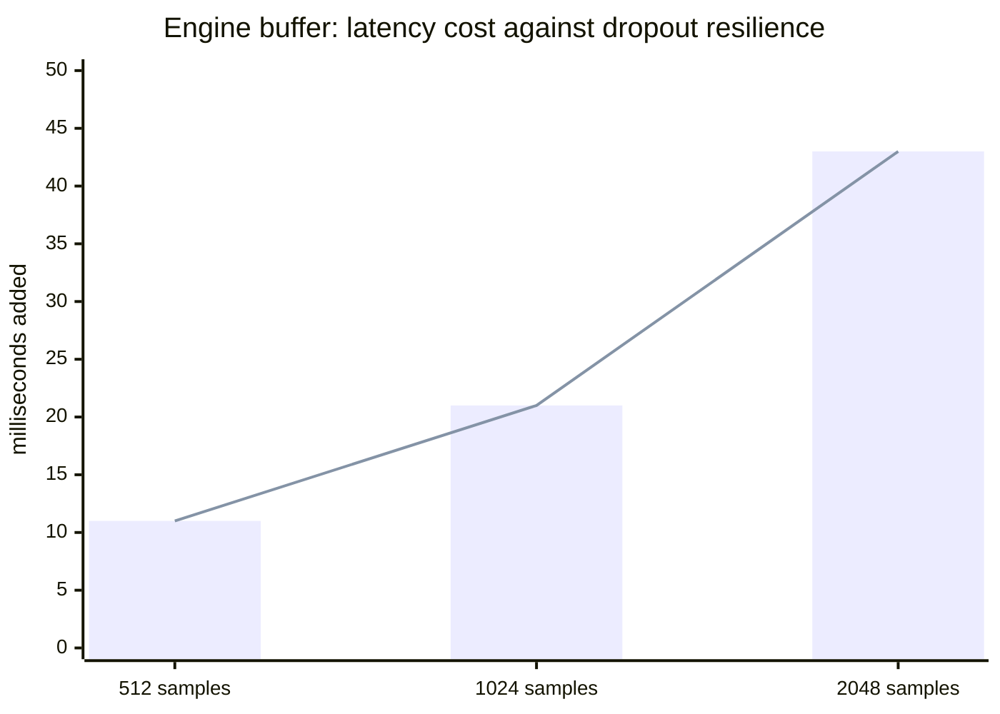

Because Chorus equalises the *relative* timing afterwards, the extra latency from a big buffer costs you nothing perceptually for music and film. It would matter for gaming or live monitoring, which this project explicitly does not target.

---

## 5. The signal path in detail

The same journey, with the mechanism at each hop rather than just the timing.

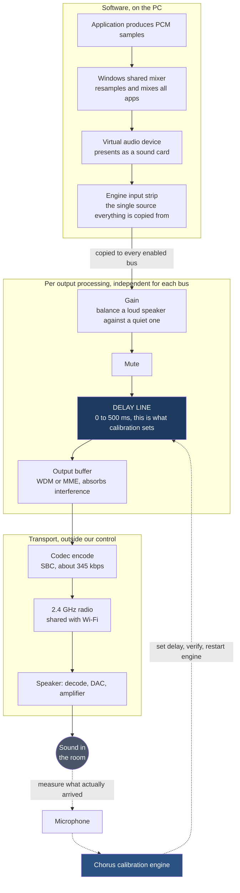

The dotted path is the entire point of the project. Every other tool in this space stops at the solid arrows, leaving the delay line to be set by hand. Chorus closes the loop through the room itself, which is the only way to learn the true arrival time of a specific speaker in a specific place.

---

## 6. Why only two Bluetooth speakers

This is the question everyone asks, and the answer is a hard limit rather than a missing feature.

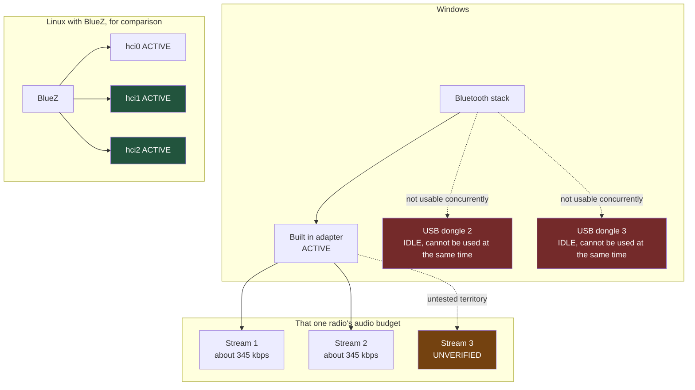

Three separate facts stack up here:

**Windows uses one Bluetooth radio at a time.** Buying USB dongles does not help. The additional adapters do not become usable alongside the built in one, and the vendor guidance is to disable the internal adapter before using an external one.

**Each stereo audio stream costs roughly 345 kbps** of that single radio's shared bandwidth, plus its own scheduling slots.

**Two streams are verified working** on the reference adapter, an Intel Wireless-AC 8260. Three or more has not been tested, so the project does not claim it. If you try it, the documentation asks you to report what happened.

Beware the widely repeated claim that Bluetooth supports seven devices. That figure is about *pairing* capacity. Audio *streaming* is bandwidth bound and the real limit is far lower. Confusing the two is the single most common error in community write ups on this subject.

To go beyond the ceiling you either mix transports, which is what the five buses are for, or move to Linux where BlueZ can drive several adapters independently.

---

## 7. The radio contention problem

Almost every dropout report traces back to this diagram.

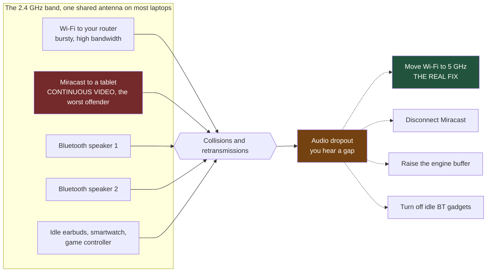

During development, dropouts every 40 to 80 seconds were chased through adapter power settings, USB selective suspend, Wi-Fi roaming aggressiveness, and three different buffer sizes. Each change helped a little. The actual cause was a Miracast session to a tablet, streaming video over Wi-Fi Direct on the same band. Disconnecting it stopped the dropouts completely.

**A two minute test that settles it.** Play a locally stored track, then turn Wi-Fi off entirely and listen. If the dropouts stop, it is band contention, and no audio setting will fully fix it. Moving your router and PC to 5 GHz is the real answer.

---

## 8. Choosing a transport

Chorus supports five outputs, but they are not interchangeable. This is how to pick.

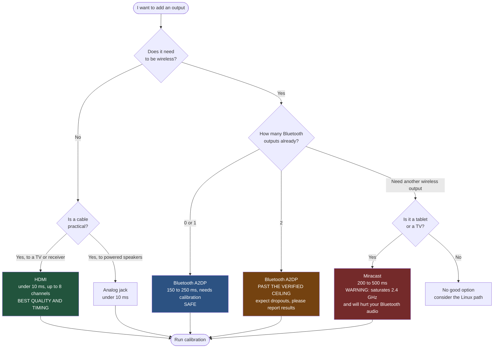

A detail that matters more than it sounds: **always identify a device by its Windows instance path, not its friendly name.**

| Transport | Instance path signature |
|---|---|
| Bluetooth stereo, what you want | `BTHENUM\{0000110B-...}` |
| Bluetooth hands free, avoid for music | `BTHENUM\{0000111E-...}` or `BTHHFENUM\` |
| Miracast | `SWD\WIFIDIRECT\...#MIRACAST` |

Every Bluetooth speaker appears twice in Windows, once as "Headphones (Name Stereo)" and once as "Headset (Name Hands-Free AG Audio)". The second is the telephone call profile: mono, roughly 8 kHz, and it sounds broken for music. The names are nearly identical and the wrong one is easy to pick.

During development, a setup that appeared to prove three simultaneous Bluetooth speakers turned out, on inspecting the instance paths, to be two Bluetooth speakers plus a Miracast tablet. Friendly names hid the difference.

---

## 9. How the measurement works

To learn a speaker's true latency you have to hear it. Chorus plays a test sound through one speaker at a time and records the room.

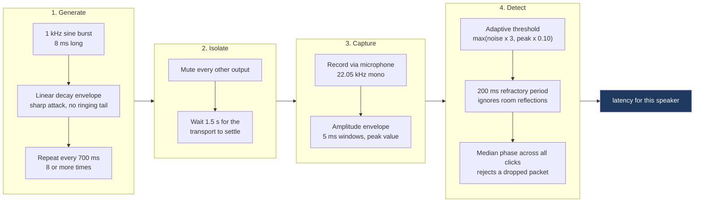

Each design choice has a reason:

| Choice | Why |
|---|---|
| 1 kHz tone | Sits inside both speaker output range and microphone sensitivity, and avoids low frequency room resonance that smears the start of the sound |
| 8 ms burst | Long enough to detect reliably, short enough to pin down exactly when it began |
| Linear decay | A sharp attack with no ringing tail, so reflections do not look like new clicks |
| 700 ms spacing | Longer than the room's echo, short enough to collect many samples quickly |
| Median, not average | One dropped Bluetooth packet cannot skew the result |
| Refractory period | A wall reflection arriving 30 ms later is not counted as a second click |

The microphone should sit roughly equidistant from your speakers. Sound travels about **2.92 ms per metre**, so a microphone one metre closer to one speaker makes that speaker look 3 ms faster than it is.

---

## 10. Solving for the delays

Once every speaker has a measured latency, the arithmetic is short.

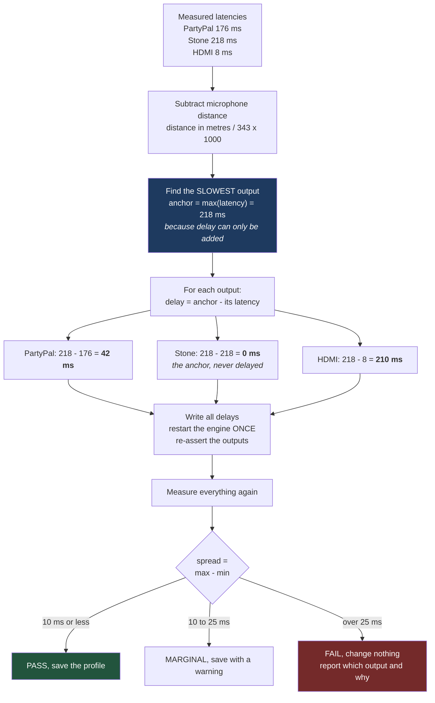

Note the last branch. **A failed calibration must leave the system exactly as it was.** Half applied delays would leave you worse off than before while appearing configured, so the profile is only written once a verification pass confirms the result.

The verification pass is not ceremony. The engine will happily report success for a delay that has no audible effect, which is exactly what happened during development with a parameter that accepted values, stored them, read them back correctly, and did nothing at all. Only re-measuring caught it.

---

## 11. The full calibration sequence

Putting sections 9 and 10 together, with the awkward engine behaviour that the implementation has to work around.

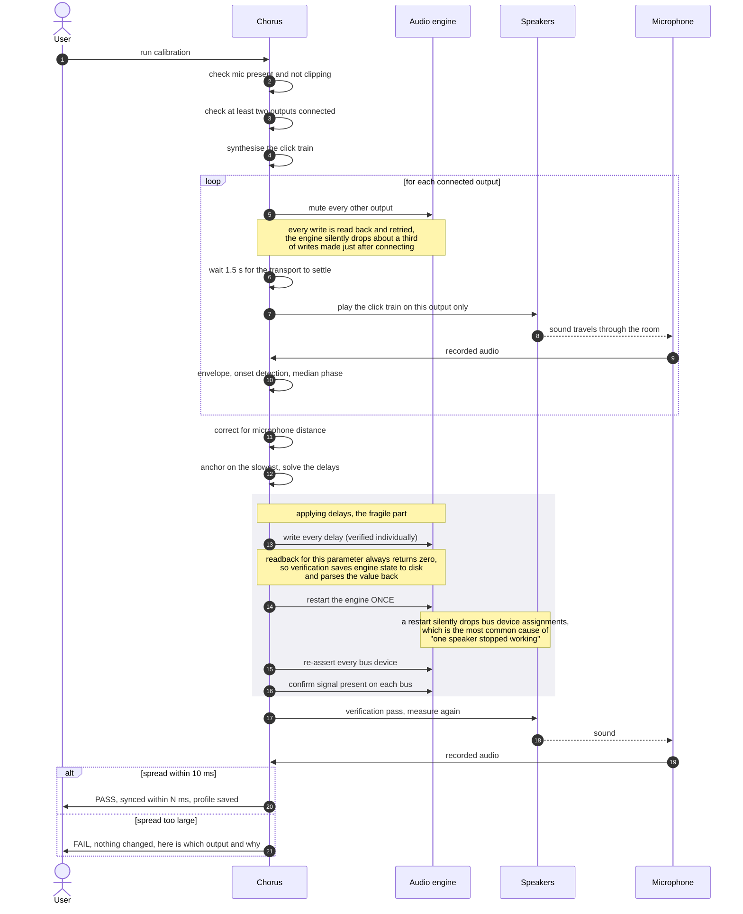

The grey block is where the implementation earns its keep. Three separate engine quirks live in that short stretch, all discovered the hard way and all documented in [BUILD-NOTES](BUILD-NOTES.md).

---

## 12. What can go wrong at runtime

Wireless outputs disappear routinely. That is the medium, not a bug, so the system treats it as an expected state rather than an error.

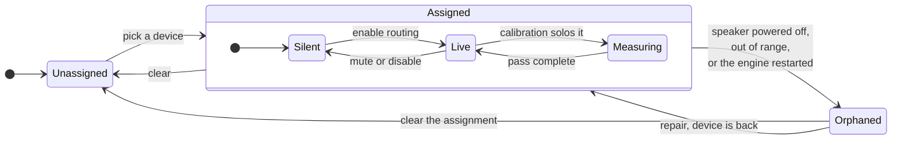

**Orphaned is the state that matters.** When a speaker switches off, or the audio engine restarts, the bus keeps its configuration but loses its actual device. The engine reports no error. Nothing appears in a log. The only symptom is one silent speaker.

Detecting and naming this state is what makes a one command repair possible, and it is why the level meters in the control panel exist. A meter is the only thing that distinguishes "the software believes this output is fine" from "sound is genuinely reaching the device".

---

## 13. Troubleshooting as a decision tree

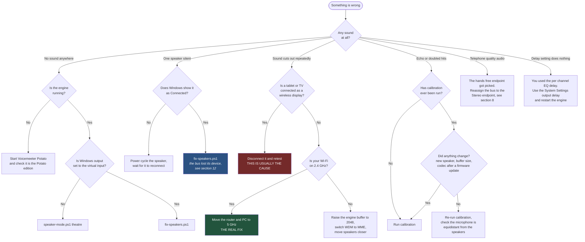

---

## Where to go next

| You want to | Read |
|---|---|
| Build this yourself, step by step | [REPRODUCE.md](../REPRODUCE.md) |
| Understand a specific problem in depth | [BUILD-NOTES.md](BUILD-NOTES.md) |
| Use the system day to day | [USER-MANUAL.md](USER-MANUAL.md) |
| See the full engineering specification | [TRD.md](TRD.md) |
| Understand the design intent and scope | [PRD.md](PRD.md) |
