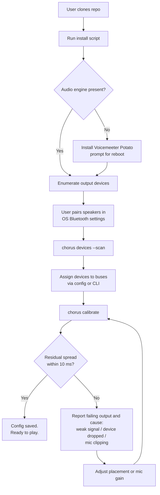
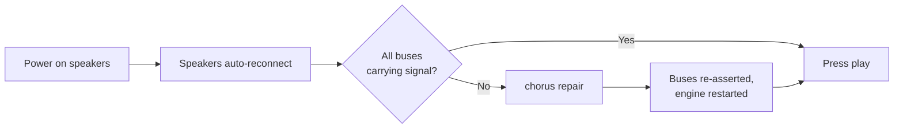

# Chorus: Product Requirements Document

| Field | Value |
|---|---|
| Document | PRD |
| Product | Chorus: Multi-Output Synchronised Audio Hub |
| Version | 0.1.0 (Draft) |
| Status | In development |
| Last updated | 2026-08-25 |
| Owner | Abhi Singh |
| Licence | MIT (proposed) |

---

## 1. Summary

Chorus turns a single Windows PC into a synchronised multi-speaker audio hub. It plays one audio source through several independent wireless and wired outputs at once: Bluetooth speakers, a Miracast tablet, HDMI, the laptop's own speakers. It also **automatically measures and corrects the timing offset between them using a microphone**.

The automatic calibration is the differentiator. Several existing tools can route audio to multiple outputs. None of them solve the part that actually ruins the experience: each output arrives at a different time, so the result sounds like an echo rather than a room full of sound.

---

## 2. Problem Statement

### 2.1 The user problem

A person owns several Bluetooth speakers bought at different times. They want them to play together as a home theatre. The obstacles, in the order they hit them:

1. **Speakers refuse to pair with each other.** Manufacturer TWS pairing (boAt TWS, JBL PartyBoost, Sony Party Chain) links only *identical models*. Mixed brands and mixed models cannot be linked at all.
2. **Auracast is unavailable.** It requires Bluetooth LE Audio hardware on the source *and* every speaker. Speakers made before roughly 2023 do not have it.
3. **Phone-based dual audio produces an audible echo.** Samsung Dual Audio and equivalents connect two speakers but expose no per-speaker latency control, so the mismatch cannot be corrected.
4. **Desktop routing tools leave sync as an exercise for the user.** Voicemeeter, VB-Cable and similar can send audio to several devices, but the user is left dragging a delay slider by ear. A genuinely miserable task, because the ear is poor at judging *which* of two sounds came first.

### 2.2 Why timing matters

| Inter-output offset | Perceived result |
|---|---|
| 0-10 ms | Single fused sound. Correct. |
| 10-25 ms | Slight widening, mild comb filtering. Usually acceptable. |
| 25-50 ms | Audible "flam", a doubled attack on percussive material. |
| > 50 ms | Distinct echo. Unusable for music or dialogue. |

Bluetooth stacks introduce 150-250 ms of latency, and **the exact figure differs per speaker model, per codec and per connection**. Two arbitrary speakers will therefore almost never agree, and the offset cannot be predicted in advance. It has to be measured on the actual hardware.

### 2.3 Why measurement beats tuning by ear

Tuning by ear requires the user to answer "which speaker fires first?" Human hearing fuses sounds below roughly 30 ms (the precedence effect) and gives almost no reliable cue about temporal order for identical broadband transients. Users can hear *that* something is wrong but not *what to change*, so they hunt blindly.

A microphone plus onset detection answers the question in a single measurement pass, in under a minute, as a number.

---

## 3. Goals and Non-Goals

### 3.1 Goals

| ID | Goal |
|---|---|
| G1 | Play one audio source through N outputs simultaneously, where N is bounded by *measured* hardware capability rather than guesswork. |
| G2 | Measure per-output latency automatically using a microphone and report it in milliseconds. |
| G3 | Apply per-output delay compensation so all outputs arrive within the fusion threshold (target ≤ 10 ms spread). |
| G4 | Persist configuration and calibration so the system works after a reboot with no re-setup. |
| G5 | Provide recovery tooling for the ordinary failure modes of wireless audio (device drops, stale assignments). |
| G6 | Document the real, measured constraints of the platform so users know what is achievable before they start. |

### 3.2 Non-Goals

| ID | Non-goal | Rationale |
|---|---|---|
| N1 | Sample-accurate sync for professional or live sound | Wireless transports jitter. The target is perceptual fusion, not studio timing. |
| N2 | Discrete surround decoding (5.1/7.1 channel mapping) | Chorus distributes the same stereo programme to every output. True surround needs an AV receiver over HDMI. |
| N3 | Cross-machine network audio (Snapcast-style multi-room) | Out of scope for v1. Voicemeeter's VBAN exists for this and can be layered on later. |
| N4 | Bypassing platform transport limits | Windows permits one Bluetooth adapter. Chorus documents this rather than pretending otherwise. |
| N5 | A mobile application | Desktop-first. The PC is the audio source. |

---

## 4. Target Users

### 4.1 Primary persona: "the accumulated-speakers owner"

- Owns 3-8 Bluetooth speakers acquired over several years; mixed brands, mixed models.
- Comfortable running a script and editing a config file; not necessarily a developer.
- Motivation: extract value from hardware already owned instead of buying a soundbar.
- Success looks like: press play, sound fills the room, no echo.

### 4.2 Secondary persona: "the DIY home-automation tinkerer"

- Runs Home Assistant, a Raspberry Pi, or similar.
- Wants a documented, scriptable component with a stable config format.
- Success looks like: a CLI callable from an automation, and a config file worth versioning.

### 4.3 Anti-persona: the audiophile

Chorus is explicitly not for someone who needs bit-perfect playback or sub-millisecond alignment. Bluetooth SBC is lossy and jittery. The documentation states this plainly rather than letting such a user discover it after installing.

---

## 5. Functional Requirements

Priority uses MoSCoW: **M**ust, **S**hould, **C**ould, **W**on't (this release).

### 5.1 Output management

| ID | Requirement | Priority |
|---|---|---|
| FR-1.1 | Enumerate available audio outputs with transport type (Bluetooth A2DP / Miracast / HDMI / analog). | M |
| FR-1.2 | Assign a device to a numbered output bus. | M |
| FR-1.3 | Enable or disable routing of the source to each bus independently. | M |
| FR-1.4 | Set per-bus gain in dB. | M |
| FR-1.5 | Mute and unmute a bus without altering its gain. | M |
| FR-1.6 | Detect that an assigned device is no longer present and report it clearly rather than failing silently. | M |
| FR-1.7 | Re-assert all bus assignments on demand (recovery from a dropped device). | M |
| FR-1.8 | Warn when the user assigns more Bluetooth outputs than the adapter has been measured to sustain. | S |

### 5.2 Calibration

| ID | Requirement | Priority |
|---|---|---|
| FR-2.1 | Generate the calibration stimulus internally; require no external audio file. | M |
| FR-2.2 | Capture the acoustic result through a user-selected microphone. | M |
| FR-2.3 | Isolate each output in turn so arrival time is attributable unambiguously. | M |
| FR-2.4 | Detect stimulus onsets in the capture and compute per-output latency. | M |
| FR-2.5 | Compute the delay each output needs in order to align with the latest output. | M |
| FR-2.6 | Apply computed delays to the audio engine and verify they took effect. | M |
| FR-2.7 | Report residual spread ("all outputs within X ms") so the user knows whether calibration succeeded. | M |
| FR-2.8 | Compensate for microphone-to-speaker distance differences, or instruct the user to place the mic equidistant. | S |
| FR-2.9 | Store a named calibration profile, recallable per room layout. | S |
| FR-2.10 | Re-run calibration automatically when a device reconnects with a changed codec. | C |

### 5.3 Modes and control

| ID | Requirement | Priority |
|---|---|---|
| FR-3.1 | Switch between named output modes (all speakers / single speaker / laptop only) with one command. | M |
| FR-3.2 | Provide an always-available volume surface with master and per-output controls. | M |
| FR-3.3 | Start with the operating system and restore previous state. | M |
| FR-3.4 | Expose all functionality via CLI so automation can drive it. | S |
| FR-3.5 | Provide a graphical control panel. | S |

### 5.4 Persistence and diagnostics

| ID | Requirement | Priority |
|---|---|---|
| FR-4.1 | Persist device assignments, gains, delays and mode definitions to a human-readable config file. | M |
| FR-4.2 | Survive a host reboot with no manual reconfiguration. | M |
| FR-4.3 | Log calibration results with timestamps for comparison over time. | S |
| FR-4.4 | Provide a diagnostic command reporting transport type, stream count and signal presence per bus. | S |
| FR-4.5 | Export a support bundle (config, logs, device inventory) for issue reports. | C |

### 5.5 Explicitly out of scope for v1

| ID | Item |
|---|---|
| W-1 | Network audio distribution to other machines (VBAN / Snapcast). |
| W-2 | Multi-adapter Bluetooth on Windows, blocked at OS level, see TRD §4.2. |
| W-3 | Per-output equalisation. |
| W-4 | Room correction beyond time alignment. |

---

## 6. Success Metrics

| Metric | Target | Method |
|---|---|---|
| Calibration accuracy | Residual spread ≤ 10 ms across active outputs | Post-calibration verification pass |
| Calibration duration | ≤ 90 s for 4 outputs | Wall-clock timing |
| First-run setup time | ≤ 15 min from clone to sound | User testing |
| Reboot survival | 100% of reboots need zero manual steps | Repeated reboot testing |
| Recovery success | ≥ 95% of dropped-device events fixed by the repair command without restarting the host | Field logging |
| Stated vs actual capability | Zero issues filed reporting "documented speaker count does not work" | Issue tracker |

The final metric is deliberate. The most likely reputational failure for this project is over-claiming how many Bluetooth speakers it supports.

---

## 7. User Journeys

### 7.1 First-time setup

### 7.2 Daily use

### 7.3 Recalibration triggers

Calibration should be re-run when any of the following change, because each alters transport latency:

- A speaker is added or replaced.
- A speaker connects with a different codec (for example SBC rather than AAC after a firmware update).
- The audio engine buffer size is changed.
- Playback develops an audible echo that was not there before.

---

## 8. Release Plan

| Phase | Scope | Exit criteria |
|---|---|---|
| **v0.1 Foundation** | Two Bluetooth outputs, manual delay entry, mode switching, volume panel, persistence | Two speakers play in sync after manual tuning; survives reboot |
| **v0.2 Automatic calibration** | Mic capture, onset detection, latency computation, delay application with verification | Calibration reaches ≤ 10 ms residual spread unattended |
| **v0.3 Capability discovery** | Measured maximum concurrent stream count per adapter, capacity warnings, diagnostics command | Reproducible ceiling published together with its method |
| **v0.4 Mixed transport** | Miracast, HDMI and analog outputs alongside Bluetooth; per-transport latency profiles | Four mixed-transport outputs calibrated together |
| **v1.0 Public release** | Installer, complete documentation, support bundle export | A third party reproduces the documented setup from the README alone |

---

## 9. Risks and Mitigations

| Risk | Impact | Likelihood | Mitigation |
|---|---|---|---|
| Adapter sustains fewer streams than users expect | High, the core promise looks broken | High | Measure and publish the real ceiling; warn at assignment time; never advertise an untested count |
| 2.4 GHz congestion causes dropouts unrelated to Chorus | Medium, appears as a product defect | High | Diagnostics command that identifies band contention; mitigations documented in the manual |
| Audio engine API silently rejects parameter writes | High, settings appear applied but are not | Confirmed, observed | Mandatory verify-after-write with retry on every parameter set (TRD §5.3) |
| Calibration biased by unequal mic distance | Medium, wrong delays applied | Medium | Document equidistant placement; add distance compensation in v0.3 |
| Dependency on a closed-source audio engine | Medium, upstream bugs cannot be fixed | Certain | Isolate every engine call behind one adapter module so an alternative backend can be substituted |
| Project mistaken for a general audiophile tool | Low, user disappointment | Medium | State transport limitations prominently in the README |

---

## 10. Open Questions

| ID | Question | Status | Needed by |
|---|---|---|---|
| Q1 | What is the true maximum concurrent A2DP stream count on the reference adapter (Intel 8260)? | Test session pending | v0.3 |
| Q2 | Do Bluetooth *headphones* behave differently from speakers when mixed into the set? | Test session pending | v0.3 |
| Q3 | Should the reference implementation move to Linux/BlueZ to permit multiple adapters? | Undecided | v1.0 |
| Q4 | Is cross-correlation materially more accurate than onset detection for this stimulus? | Prototype comparison | v0.2 |
| Q5 | Is a built-in laptop microphone adequate, or should an external mic be required? | Test session pending | v0.2 |

---

## 11. Appendix: Competitive Landscape

| Project | Approach | Overlap | Gap Chorus fills |
|---|---|---|---|
| [Soundsync](https://github.com/geekuillaume/soundsync) | Network audio distribution across devices | Multi-output routing | No acoustic calibration; network-oriented rather than local multi-transport |
| [sendspin-bt-bridge](https://github.com/trudenboy/sendspin-bt-bridge) | One playback subprocess per Bluetooth speaker, Home Assistant integration | Multi-Bluetooth output | No automatic timing measurement |
| [multi-blue](https://github.com/Dannymo11/multi-blue) | Low-latency multi-Bluetooth output | Multi-Bluetooth output | Minimises latency but does not equalise it between devices |
| [SyncWave](https://github.com/CodeWithDevesh/SyncWave) | CLI for simultaneous playback to multiple Windows devices | Multi-output routing on Windows | No calibration, no persistence model |
| Voicemeeter (VB-Audio) | General-purpose virtual mixer | The underlying engine Chorus builds on | Delay tuning is manual and undocumented; Chorus automates and documents it |

**Positioning statement:** Chorus is not another audio router. It is a *calibration* tool that happens to include routing, and the microphone loop is the reason it exists.
