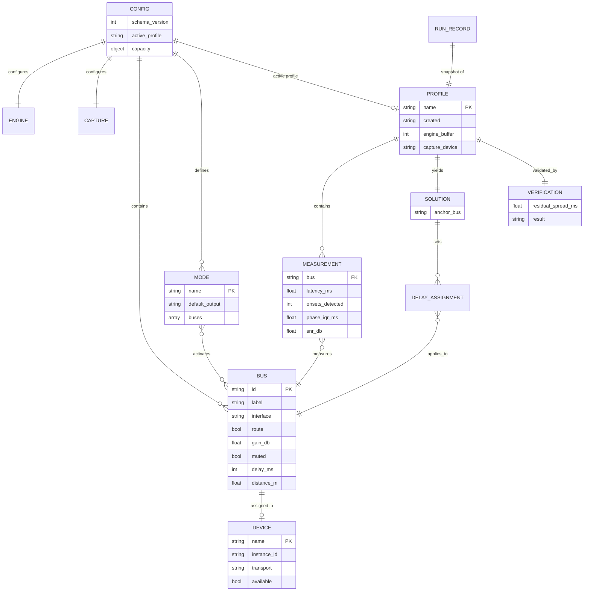
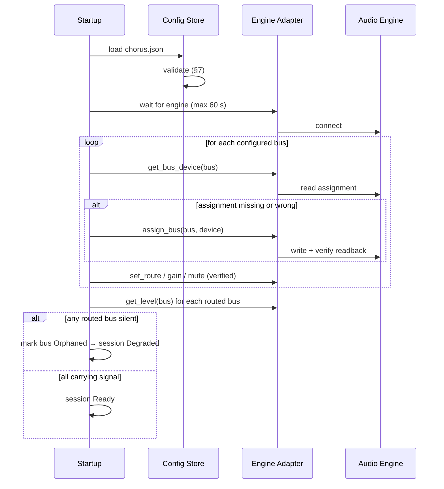

# Chorus: Backend Schema

| Field | Value |
|---|---|
| Document | Backend / Data Schema |
| Product | Chorus: Multi-Output Synchronised Audio Hub |
| Schema version | 1 |
| Version | 0.1.0 (Draft) |
| Last updated | 2026-08-25 |
| Companion documents | [PRD](PRD.md) · [TRD](TRD.md) · [UI Flow](UI-FLOW.md) · [User Manual](USER-MANUAL.md) |

---

## 1. Storage Model

Chorus has no database. State is a small number of human-readable JSON files, because the configuration is small, must be hand-editable (NFR-5), and benefits from being version-controllable by the user.

```
%APPDATA%\Chorus\
├── chorus.json                 # desired state. The single source of truth
├── profiles\
│   ├── living-room.json        # calibration profile
│   └── bedroom.json
├── logs\
│   ├── chorus.log              # rolling application log
│   └── calibration-<ts>.json   # immutable measurement record per run
└── cache\
    └── devices.json            # last-seen device inventory (regenerable)
```

| Property | Rule |
|---|---|
| Authority | `chorus.json` is desired state. The audio engine holds actual state. They are reconciled at startup and after every engine restart. |
| Regenerability | Anything under `cache\` may be deleted safely. |
| Immutability | Calibration run records are append-only and never rewritten. |
| Encoding | UTF-8 without BOM, LF line endings, two-space indent. |
| Secrets | None. No file contains credentials; the whole tree is safe to attach to a bug report. |

---

## 2. Entity Model



---

## 3. `chorus.json`: Main Configuration

### 3.1 Example

```json
{
  "schema_version": 1,
  "engine": {
    "backend": "voicemeeter-potato",
    "preferred_interface": "mme",
    "buffers": { "wdm": 1024, "mme": 2048, "ks": 512 },
    "autostart": true,
    "restart_settle_ms": 4000
  },
  "capture": {
    "device": "Microphone (Realtek High Definition Audio)",
    "sample_rate": 22050,
    "channels": 1,
    "gain_policy": "manual"
  },
  "capacity": {
    "bluetooth_a2dp_measured_max": 2,
    "measured_on": "Intel Dual Band Wireless-AC 8260",
    "measured_date": "2026-08-25",
    "warn_above": 2,
    "block_above": null
  },
  "buses": [
    {
      "id": "A1",
      "label": "PartyPal 185",
      "device": {
        "name": "Headphones (PartyPal 185 Stereo)",
        "instance_id": "BTHENUM\\{0000110B-0000-1000-8000-00805F9B34FB}_LOCALMFG&0002\\7&1a2b3c4d&0&AABBCCDDEE01_C00000000",
        "transport": "bluetooth-a2dp"
      },
      "interface": "mme",
      "route": true,
      "gain_db": -12.0,
      "muted": false,
      "delay_ms": 42,
      "distance_m": 2.0
    },
    {
      "id": "A2",
      "label": "Stone 1400",
      "device": {
        "name": "Headphones (boAt Stone 1400 Stereo)",
        "instance_id": "BTHENUM\\{0000110B-0000-1000-8000-00805F9B34FB}_VID&0002099A_PID&0500\\7&1a2b3c4d&0&AABBCCDDEE02_C00000000",
        "transport": "bluetooth-a2dp"
      },
      "interface": "mme",
      "route": true,
      "gain_db": -3.0,
      "muted": false,
      "delay_ms": 0,
      "distance_m": 2.0
    },
    {
      "id": "A3",
      "label": "Tab S9 FE+",
      "device": {
        "name": "Digital Output (Abhishek's Tab S9 FE+)",
        "instance_id": "SWD\\WIFIDIRECT\\AA:BB:CC:DD:EE:03#MIRACAST",
        "transport": "miracast"
      },
      "interface": "wdm",
      "route": false,
      "gain_db": -8.0,
      "muted": false,
      "delay_ms": 0,
      "distance_m": 3.0
    }
  ],
  "modes": [
    {
      "name": "theatre",
      "description": "All speakers through the hub",
      "default_output": "__virtual__",
      "buses": ["A1", "A2"]
    },
    {
      "name": "partypal",
      "description": "PartyPal only, engine bypassed",
      "default_output": "Headphones (PartyPal 185 Stereo)",
      "buses": []
    },
    {
      "name": "laptop",
      "description": "Built-in speakers",
      "default_output": "Speakers (Realtek High Definition Audio)",
      "buses": []
    }
  ],
  "active_profile": "living-room",
  "startup": {
    "restore_mode": "theatre",
    "verify_assignments": true,
    "max_wait_for_engine_s": 60
  }
}
```

### 3.2 Field reference

#### `engine`

| Field | Type | Required | Default | Notes |
|---|---|---|---|---|
| `backend` | enum | yes | `voicemeeter-potato` | Future: `pipewire` |
| `preferred_interface` | enum | yes | `wdm` | `wdm` \| `mme` \| `ks`. `mme` buffers deeper, better dropout tolerance, more latency (TRD §3.3) |
| `buffers` | object | no | see below | Per-interface buffer size in samples |
| `buffers.<iface>` | int | no | `1024` | Allowed: 128-2048, power of two |
| `autostart` | bool | no | `true` | Launch engine with the host |
| `restart_settle_ms` | int | no | `4000` | Wait after engine restart before re-asserting assignments (TRD D3) |

#### `capture`

| Field | Type | Required | Default | Notes |
|---|---|---|---|---|
| `device` | string | yes | n/a | Windows friendly name of the calibration microphone |
| `sample_rate` | int | no | `22050` | 22.05 kHz gives 45 µs resolution, ample for a 1 ms target |
| `channels` | int | no | `1` | Mono only |
| `gain_policy` | enum | no | `manual` | `manual` \| `auto`. `auto` reserved for a future AGC pass |

#### `capacity`

Encodes the measured transport ceiling so warnings cite a real number (TRD §4.1, F9).

| Field | Type | Required | Notes |
|---|---|---|---|
| `bluetooth_a2dp_measured_max` | int \| null | yes | `null` means "not yet measured on this host", the UI must then say so rather than invent a figure |
| `measured_on` | string | no | Adapter name the figure was measured against |
| `measured_date` | date | no | ISO 8601 |
| `warn_above` | int \| null | no | Warn when assigned A2DP outputs exceed this |
| `block_above` | int \| null | no | Hard refusal threshold. `null` = never block, only warn |

`block_above` defaults to `null` deliberately: the user owns their hardware, and a project whose central open question is "how many actually work?" must let people exceed the current figure and report back.

#### `buses[]`

| Field | Type | Required | Constraints | Notes |
|---|---|---|---|---|
| `id` | string | yes | `A1`-`A5` | Engine bus identifier |
| `label` | string | yes | 1-40 chars | Display name |
| `device` | object \| null | yes | n/a | `null` = unassigned |
| `device.name` | string | yes | n/a | OS friendly name; used for assignment |
| `device.instance_id` | string | yes | n/a | Stable identity; used for transport detection and re-matching |
| `device.transport` | enum | yes | see §4 | Derived from `instance_id`, never from the name |
| `interface` | enum | yes | `wdm`\|`mme`\|`ks` | Driver interface for this bus |
| `route` | bool | yes | n/a | Source routed to this bus |
| `gain_db` | float | yes | −60.0 … +12.0 | Engine range; UI exposes −40 … +6 |
| `muted` | bool | yes | n/a | Independent of gain |
| `delay_ms` | int | yes | 0 … 500 | Applied delay; engine restart required to take effect |
| `distance_m` | float | no | 0.1 … 20.0 | Microphone distance for calibration correction (FR-2.8) |

#### `modes[]`

| Field | Type | Required | Notes |
|---|---|---|---|
| `name` | string | yes | Unique, lowercase, no spaces |
| `description` | string | no | Shown in the tray submenu |
| `default_output` | string | yes | OS device name, or the sentinel `__virtual__` to route through the engine |
| `buses` | array\<string\> | yes | Bus IDs to enable. Empty for engine-bypass modes |

The `__virtual__` sentinel distinguishes hub modes from direct modes. Direct modes point the OS default straight at one device so they work even when the engine is not running, which is exactly what a user needs when they want one speaker and nothing else.

---

## 4. Transport Enumeration

`device.transport` is derived from the instance path (TRD §4.3), never from the friendly name.

| Value | Instance-path pattern | Assignable |
|---|---|---|
| `bluetooth-a2dp` | `BTHENUM\{0000110B-...}` | Yes |
| `bluetooth-hfp` | `BTHENUM\{0000111E-...}`, `BTHHFENUM\` | **No**, mono, ~8 kHz, excluded from output selection |
| `miracast` | `SWD\WIFIDIRECT\...#MIRACAST` | Yes |
| `hdmi` | Display-audio driver interface | Yes |
| `analog` | Onboard codec interface | Yes |
| `virtual` | Engine's own virtual endpoints | Internal use only |
| `unknown` | No pattern matched | Yes, with a warning |

Excluding `bluetooth-hfp` from the assignable list is a functional requirement, not a nicety: those endpoints appear alongside the good ones with near-identical names, and selecting one silently degrades the speaker to telephone quality.

---

## 5. Calibration Profile

Stored at `profiles\<name>.json`. Written only on a passing or marginal verification.

```json
{
  "schema_version": 1,
  "name": "living-room",
  "created": "2026-08-25T18:04:22+05:30",
  "host": {
    "engine": "voicemeeter-potato 3.1.2.2",
    "engine_buffer": 2048,
    "engine_interface": "mme",
    "adapter": "Intel Dual Band Wireless-AC 8260"
  },
  "capture": {
    "device": "Microphone (Realtek High Definition Audio)",
    "sample_rate": 22050
  },
  "stimulus": {
    "waveform": "sine-burst",
    "frequency_hz": 1000,
    "burst_ms": 8,
    "envelope": "linear-decay",
    "period_ms": 700,
    "periods_per_output": 8,
    "peak_dbfs": -6.0
  },
  "measurements": [
    {
      "bus": "A1",
      "device_name": "Headphones (PartyPal 185 Stereo)",
      "transport": "bluetooth-a2dp",
      "onsets_expected": 8,
      "onsets_detected": 8,
      "phase_median_ms": 176.4,
      "phase_iqr_ms": 3.5,
      "snr_db": 22.4,
      "distance_m": 2.0,
      "distance_correction_ms": 5.8,
      "latency_ms": 170.6,
      "quality": "good"
    },
    {
      "bus": "A2",
      "device_name": "Headphones (boAt Stone 1400 Stereo)",
      "transport": "bluetooth-a2dp",
      "onsets_expected": 8,
      "onsets_detected": 8,
      "phase_median_ms": 218.4,
      "phase_iqr_ms": 4.1,
      "snr_db": 19.8,
      "distance_m": 2.0,
      "distance_correction_ms": 5.8,
      "latency_ms": 212.6,
      "quality": "good"
    }
  ],
  "solution": {
    "anchor_bus": "A2",
    "anchor_latency_ms": 212.6,
    "delays": { "A1": 42, "A2": 0 }
  },
  "verification": {
    "performed": true,
    "residual_spread_ms": 6.0,
    "threshold_ms": 10.0,
    "result": "pass",
    "per_bus_latency_ms": { "A1": 212.6, "A2": 218.6 }
  }
}
```

### 5.1 Measurement fields

| Field | Type | Notes |
|---|---|---|
| `onsets_expected` / `onsets_detected` | int | A shortfall indicates dropped packets or a weak signal |
| `phase_median_ms` | float | Median onset phase modulo the stimulus period (TRD §6.4) |
| `phase_iqr_ms` | float | Inter-quartile range, the transport-stability figure |
| `snr_db` | float | Stimulus peak over noise floor |
| `distance_correction_ms` | float | `distance_m / 343 × 1000`, subtracted from phase |
| `latency_ms` | float | Distance-corrected latency; the value the solver uses |
| `quality` | enum | `good` \| `marginal` \| `unusable`, from the rules below |

### 5.2 Quality classification

| Quality | Conditions (all must hold) |
|---|---|
| `good` | `onsets_detected == onsets_expected`, `phase_iqr_ms ≤ 8`, `snr_db ≥ 12` |
| `marginal` | `onsets_detected ≥ 0.75 × expected`, `phase_iqr_ms ≤ 20`, `snr_db ≥ 6` |
| `unusable` | Anything else, excluded from the solution and reported to the user |

### 5.3 Verification results

| `result` | Condition | Profile persisted? |
|---|---|---|
| `pass` | `residual_spread_ms ≤ threshold_ms` | Yes |
| `marginal` | `threshold_ms < spread ≤ 2.5 × threshold_ms` | Yes, with warning |
| `fail` | `spread > 2.5 × threshold_ms`, or any output `unusable` | **No** |

A failed run still writes an immutable record to `logs\calibration-<ts>.json`, but must not modify `chorus.json`. Partial application is the worst outcome: it leaves the system less synchronised than before while appearing configured.

---

## 6. Device Cache

`cache\devices.json`, regenerable, non-authoritative.

```json
{
  "schema_version": 1,
  "scanned": "2026-08-25T18:00:11+05:30",
  "devices": [
    {
      "name": "Headphones (PartyPal 185 Stereo)",
      "instance_id": "BTHENUM\\{0000110B-...}",
      "transport": "bluetooth-a2dp",
      "state": "active",
      "available": true,
      "last_seen": "2026-08-25T18:00:11+05:30"
    },
    {
      "name": "Headset (PartyPal 185 Hands-Free AG Audio)",
      "instance_id": "BTHHFENUM\\BTHHFPAUDIO\\...",
      "transport": "bluetooth-hfp",
      "state": "active",
      "available": true,
      "assignable": false,
      "excluded_reason": "hands-free profile, mono, low bandwidth"
    }
  ]
}
```

Retaining excluded devices with an explicit reason lets the UI explain *why* a device the user can see in Windows does not appear in the assignable list.

---

## 7. Validation Rules

Enforced by `chorus config validate` and on every load.

| ID | Rule | Severity |
|---|---|---|
| V-1 | `schema_version` is known and ≤ current | Error |
| V-2 | Bus `id` values are unique and within `A1`-`A5` | Error |
| V-3 | No two buses reference the same `device.instance_id` | Error |
| V-4 | `gain_db` within −60 … +12 | Error |
| V-5 | `delay_ms` integer within 0 … 500 | Error |
| V-6 | Buffer sizes are powers of two within 128 … 2048 | Error |
| V-7 | Every `modes[].buses[]` entry references an existing bus | Error |
| V-8 | Mode names are unique | Error |
| V-9 | `active_profile` names an existing profile file, or is `null` | Warning |
| V-10 | No assigned device has `transport == "bluetooth-hfp"` | Error |
| V-11 | Count of routed `bluetooth-a2dp` buses ≤ `capacity.warn_above` | Warning |
| V-12 | At least one bus is routed in the mode named by `startup.restore_mode` | Warning |
| V-13 | `distance_m` present on all buses, or absent on all | Warning |

V-13 exists because mixing declared and undeclared distances silently biases the solution. The correction would be applied to some outputs and not others.

---

## 8. Startup Reconciliation

Desired state (`chorus.json`) is reconciled against actual engine state at every startup and after every engine restart.



The per-bus verification loop is not defensive over-engineering: on the reference platform, engine restarts drop assignments silently (TRD D3), so unconditional re-assertion is the only reliable path to a known-good state.

---

## 9. Logging

### 9.1 Application log

Rolling, 5 files × 1 MB, plain text:

```
2026-08-25T18:04:22+05:30  INFO   engine    connected: Voicemeeter Potato 3.1.2.2
2026-08-25T18:04:23+05:30  WARN   bus.A3    device not found: Digital Output (Abhishek's Tab S9 FE+)
2026-08-25T18:04:23+05:30  INFO   session   state=Degraded (2 of 3 outputs active)
2026-08-25T18:05:02+05:30  INFO   calib     run started, profile=living-room, outputs=2
2026-08-25T18:05:41+05:30  INFO   calib     A1 latency=170.6ms iqr=3.5ms snr=22.4dB quality=good
2026-08-25T18:06:19+05:30  INFO   calib     A2 latency=212.6ms iqr=4.1ms snr=19.8dB quality=good
2026-08-25T18:06:20+05:30  INFO   calib     solution anchor=A2 delays={A1:42,A2:0}
2026-08-25T18:06:31+05:30  INFO   calib     verification spread=6.0ms result=pass
```

### 9.2 Calibration run records

One immutable JSON file per run at `logs\calibration-<ISO8601>.json`, containing the full profile structure (§5) plus `result` even when failed. These accumulate into the dataset that answers the project's central open question, how many outputs a given adapter really sustains, and how latency varies by device and codec.

---

## 10. Schema Evolution

| Rule | Detail |
|---|---|
| Version field | Every file carries `schema_version` |
| Compatibility | A newer Chorus reads older configs; an older Chorus refuses a newer `schema_version` with a clear message rather than misparsing |
| Migration | On load, migrations run in sequence `v(n) → v(n+1)`; the pre-migration file is copied to `chorus.json.bak-v<n>` |
| Additive changes | New optional fields with defaults do **not** bump the version |
| Breaking changes | Renames, removals, or semantic changes bump the version and require a migration |

### 10.1 Planned migrations

| From → To | Change | Migration |
|---|---|---|
| 1 → 2 | Per-output EQ (PRD W-3, deferred) | Add `buses[].eq` defaulting to bypass |
| 1 → 2 | Network outputs (PRD N3) | Add `transport: "vban"`, extend `device` with endpoint fields |

---

## 11. JSON Schema (excerpt)

Published at `schema/chorus.schema.json` for editor validation.

```json
{
  "$schema": "http://json-schema.org/draft-07/schema#",
  "title": "Chorus Configuration",
  "type": "object",
  "required": ["schema_version", "engine", "buses"],
  "properties": {
    "schema_version": { "type": "integer", "minimum": 1, "maximum": 1 },
    "engine": {
      "type": "object",
      "required": ["backend", "preferred_interface"],
      "properties": {
        "backend": { "enum": ["voicemeeter-potato", "pipewire"] },
        "preferred_interface": { "enum": ["wdm", "mme", "ks"] },
        "buffers": {
          "type": "object",
          "additionalProperties": {
            "type": "integer",
            "enum": [128, 256, 512, 1024, 2048]
          }
        },
        "autostart": { "type": "boolean" },
        "restart_settle_ms": { "type": "integer", "minimum": 0, "maximum": 30000 }
      }
    },
    "buses": {
      "type": "array",
      "maxItems": 5,
      "items": {
        "type": "object",
        "required": ["id", "label", "device", "interface", "route", "gain_db", "muted", "delay_ms"],
        "properties": {
          "id": { "enum": ["A1", "A2", "A3", "A4", "A5"] },
          "label": { "type": "string", "minLength": 1, "maxLength": 40 },
          "device": {
            "oneOf": [
              { "type": "null" },
              {
                "type": "object",
                "required": ["name", "instance_id", "transport"],
                "properties": {
                  "name": { "type": "string" },
                  "instance_id": { "type": "string" },
                  "transport": {
                    "enum": ["bluetooth-a2dp", "bluetooth-hfp", "miracast",
                             "hdmi", "analog", "virtual", "unknown"]
                  }
                }
              }
            ]
          },
          "interface": { "enum": ["wdm", "mme", "ks"] },
          "route": { "type": "boolean" },
          "gain_db": { "type": "number", "minimum": -60, "maximum": 12 },
          "muted": { "type": "boolean" },
          "delay_ms": { "type": "integer", "minimum": 0, "maximum": 500 },
          "distance_m": { "type": "number", "minimum": 0.1, "maximum": 20 }
        }
      }
    }
  }
}
```
