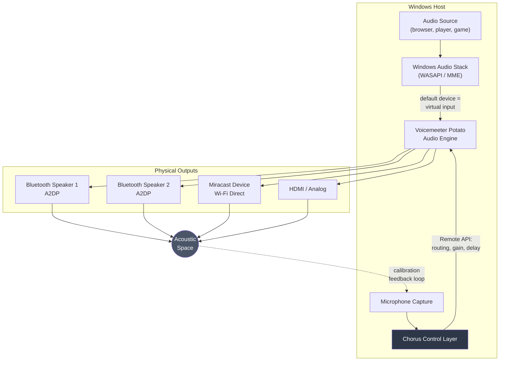
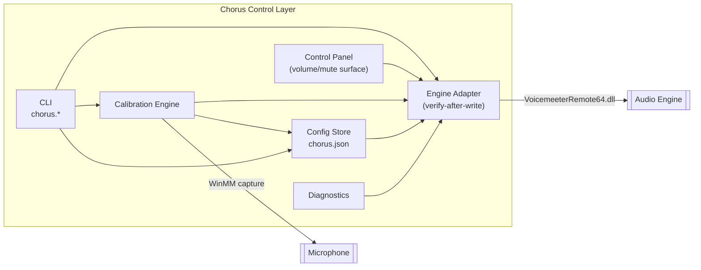
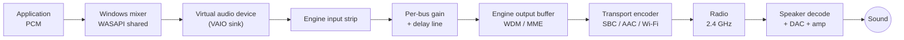
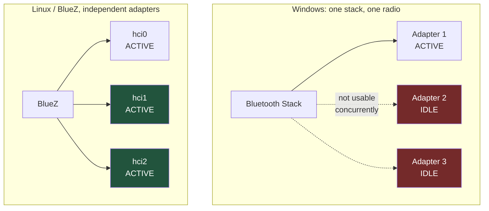
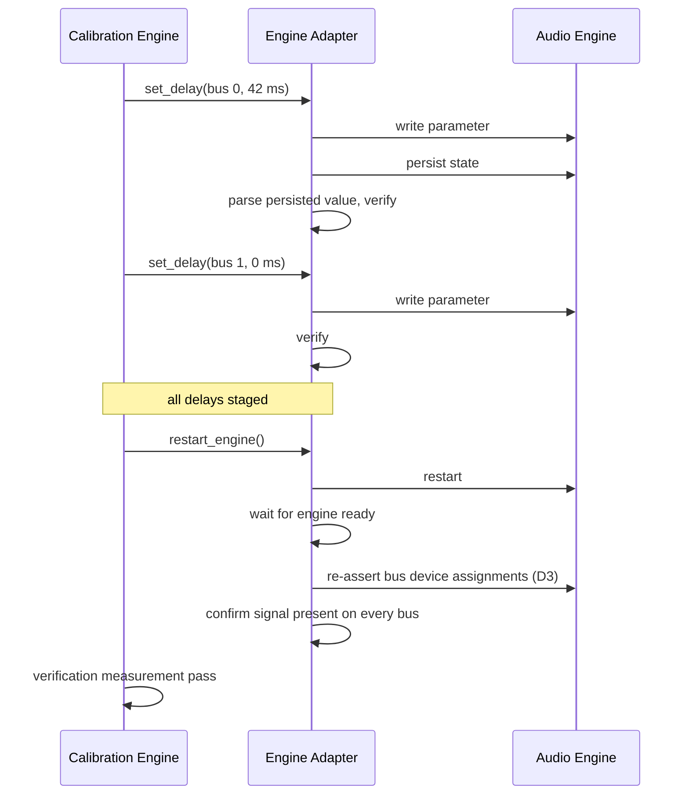
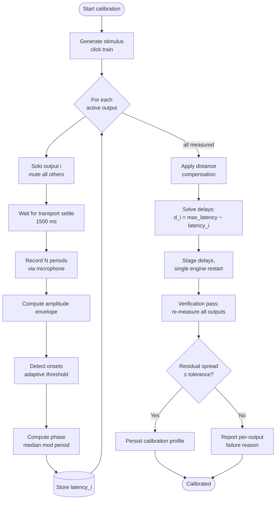
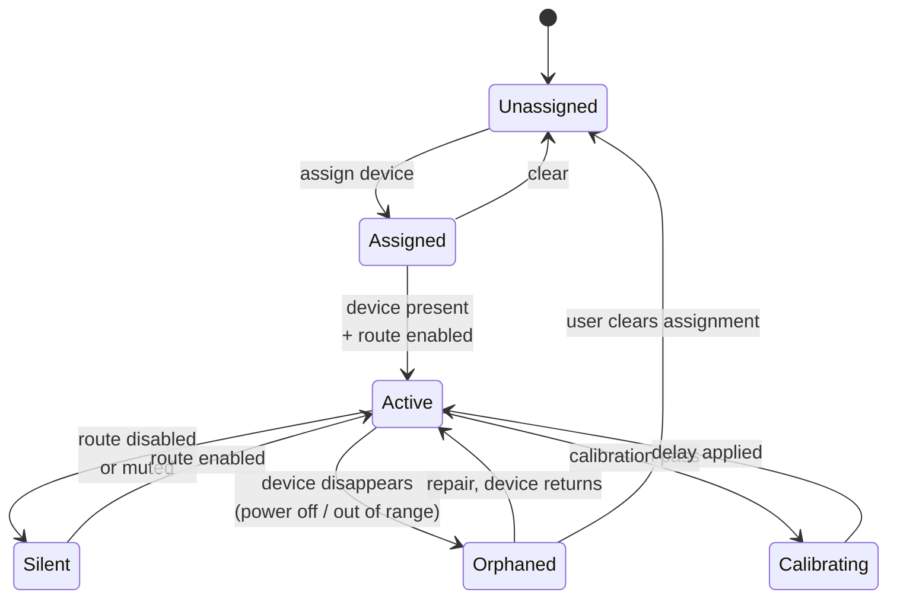
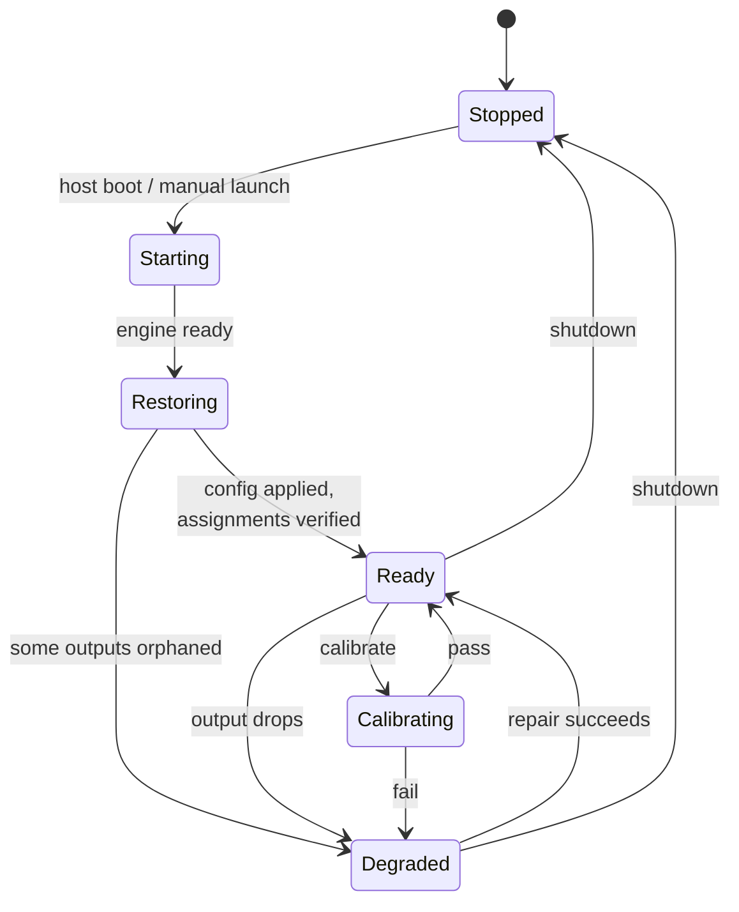

# Chorus: Technical Requirements Document

| Field | Value |
|---|---|
| Document | TRD |
| Product | Chorus: Multi-Output Synchronised Audio Hub |
| Version | 0.1.0 (Draft) |
| Status | In development |
| Last updated | 2026-08-25 |
| Reference platform | Windows 10 Pro 19045, Intel Dual Band Wireless-AC 8260, Voicemeeter Potato 3.1.2.2 |
| Companion documents | [PRD](PRD.md) · [Schema](SCHEMA.md) · [UI Flow](UI-FLOW.md) · [User Manual](USER-MANUAL.md) |

---

## 1. Scope

This document specifies the technical design of Chorus: the architecture, the transport constraints that bound it, the audio-engine integration contract, and the calibration algorithm that is the product's reason for existing.

Every performance figure and platform limit stated here is either **measured on the reference platform** (marked *measured*) or **cited from vendor documentation** (marked *cited*). Figures that are neither are marked *assumed* and must not be published as fact.

---

## 2. System Architecture

### 2.1 Context



The dotted line is the whole point of the product. Everything above it is routing that other tools also do; the closed loop through the acoustic space is what makes the delays correct rather than guessed.

### 2.2 Component responsibilities



| Component | Responsibility | Must not |
|---|---|---|
| **Engine Adapter** | Sole owner of all audio-engine calls. Implements the verify-after-write contract (§5.3). | Be bypassed by any other component. |
| **Calibration Engine** | Stimulus generation, capture, onset detection, latency solution, delay application, verification. | Write engine parameters directly, it goes through the Engine Adapter. |
| **Config Store** | Load/save/validate `chorus.json`. Single source of truth for desired state. | Contain engine-specific parameter names. |
| **CLI / Control Panel** | User-facing surfaces. | Contain calibration or engine logic. |
| **Diagnostics** | Transport identification, signal presence, band-contention reporting. | Mutate state. |

The strict rule that only the Engine Adapter touches the audio engine exists because the engine's API is unreliable in specific, documented ways (§5.3). Centralising the workaround is the only way to keep it correct.

---

## 3. Signal Path and Latency Budget

### 3.1 Path



### 3.2 Budget

| Stage | Typical contribution | Source | Controllable by Chorus |
|---|---|---|---|
| Application buffer | 10-40 ms | *assumed* | No |
| Windows shared mixer | ~10 ms | *cited* | No |
| Virtual device → engine | ~5 ms | *assumed* | No |
| Engine output buffer (WDM 1024 @ 48 kHz) | ~21 ms | *computed* | **Yes**, buffer size setting |
| Engine output buffer (MME 2048 @ 48 kHz) | ~43 ms | *computed* | **Yes** |
| A2DP encode + transmit + speaker decode | 100-200 ms | *cited* | No |
| Miracast video-locked audio | 200-500 ms | *cited* | No |
| HDMI / analog | < 10 ms | *cited* | No |
| **Total, Bluetooth path** | **150-250 ms** | | |

Two consequences drive the design:

1. **Absolute latency cannot be fixed.** A 200 ms Bluetooth delay is inherent. Chorus does not attempt to reduce it.
2. **Relative latency can and must be fixed.** Only the *difference* between outputs is perceptible as echo, and only the difference is correctable, by delaying every earlier output to match the latest one.

This is why the delay solution anchors on the **slowest** output (§6.5). Delay can only be added, never removed.

### 3.3 Buffer size trade-off

*Measured on reference platform.* Larger engine buffers absorb radio contention and reduce dropouts, at the cost of added latency that calibration then equalises away as an offset.

| Buffer (samples) | Added latency @ 48 kHz | Dropout resilience |
|---|---|---|
| 512 | ~11 ms | Poor under 2.4 GHz contention |
| 1024 | ~21 ms | Moderate |
| 2048 | ~43 ms | Best available |

Recommended default: **1024 (WDM)** for mixed use, **2048 (MME)** where dropouts persist. Since Chorus equalises relative timing, the latency penalty of a large buffer costs nothing perceptually for playback-only use. It does matter for anything interactive, which is out of scope (PRD §3.2 N1).

---

## 4. Transport Constraints

This section is the empirical heart of the project. Publishing these limits accurately is a stated success metric (PRD §6).

### 4.1 Bluetooth A2DP capacity

| Property | Value | Basis |
|---|---|---|
| Bandwidth per SBC stream | ~345 kbps | *cited* |
| Concurrent A2DP streams, reference adapter | **2 confirmed working** | *measured*, both buses carried signal simultaneously and sustained playback |
| Concurrent A2DP streams, 3+ | **Unverified** | Pending test session. Must not be claimed until measured. |
| Paired-device limit per adapter | 7 ACL links | *cited*, note this is *pairing* capacity, not simultaneous *streaming* capacity |
| Practical ceiling driver | Radio bandwidth and scheduling slots, not the pairing limit | *cited* |

**Critical distinction for documentation:** the widely quoted "7 Bluetooth devices" figure refers to ACL link capacity. Audio streaming is bandwidth-bound and the real streaming limit is far lower. Conflating the two is the most common error in community write-ups on this subject.

### 4.2 Windows single-adapter constraint

Windows binds its Bluetooth stack to **one radio at a time**. Adding USB Bluetooth dongles does not increase capacity; the additional adapters do not become independently usable, and vendor guidance is to *disable* the built-in adapter before using an external one.



**Design consequence.** On Windows, total Bluetooth output count equals the per-adapter stream ceiling. Scaling beyond that requires either a different OS (BlueZ addresses adapters independently) or non-Bluetooth transports for the additional outputs. This constraint is architectural, not a defect to be engineered around, and the README must say so.

### 4.3 Transport identification

Transport type is determined from the Windows device instance path, not the friendly name. Friendly names are unreliable. A Miracast tablet and a Bluetooth speaker can both present as generic "Digital Output" or "Headphones".

| Transport | Instance-path signature | Notes |
|---|---|---|
| Bluetooth A2DP | `BTHENUM\{0000110B-...}` | `0000110B` is the A2DP Audio Sink service UUID |
| Bluetooth hands-free | `BTHENUM\{0000111E-...}` / `BTHHFENUM\` | Mono, ~8 kHz. Must be excluded from output selection |
| Miracast | `SWD\WIFIDIRECT\...#MIRACAST`, device class `Miracast` | Wi-Fi Direct, not Bluetooth |
| HDMI / DisplayPort | Display-audio driver interface | Multi-channel capable |
| Analog | Onboard codec interface | |

*Measured:* on the reference platform, a Samsung tablet used as a third output resolved to `SWD\WIFIDIRECT\...#MIRACAST`, confirming it consumed Wi-Fi bandwidth rather than an A2DP slot. Any claim about "N Bluetooth outputs" must be validated against instance paths, because an inadvertently mixed-transport test will overstate Bluetooth capacity.

**FR-1.1 requirement:** the device enumerator must report transport type derived from instance path, and must exclude hands-free endpoints from the assignable output list.

### 4.4 Radio coexistence

Bluetooth and 2.4 GHz Wi-Fi share the ISM band, and on combo cards frequently share an antenna. *Measured on the reference platform:* an active Miracast session alongside two A2DP streams produced periodic audio dropouts; terminating the Miracast session eliminated them.

Mitigations, in descending order of effectiveness:

| Mitigation | Effect | Applied where |
|---|---|---|
| Move host Wi-Fi to 5 GHz | Removes the primary contender from the band | Router configuration, outside Chorus |
| Avoid concurrent Miracast | Removes a high-bandwidth contender | Documented; diagnostics warns |
| Increase engine buffer | Absorbs brief contention | Engine setting |
| Disable radio power management | Prevents power-saving-induced gaps | Host configuration, applied by installer |
| Reduce Wi-Fi roaming scans | Fewer periodic off-channel excursions | Adapter driver property |

Diagnostics (FR-4.4) must detect and report: Wi-Fi band in use, active Miracast sessions, and count of active A2DP streams, because these three explain the large majority of dropout reports.

---

## 5. Audio Engine Integration

### 5.1 Engine selection

Voicemeeter Potato is the v1 backend: it provides five addressable physical output buses, per-bus gain and delay, and a documented C API (`VoicemeeterRemote64.dll`). *Measured:* buses `Bus[0]`-`Bus[4]` are all addressable, and VBAN network streams are exposed but unused in v1.

It is closed-source, which is an accepted risk (PRD §9). The Engine Adapter interface is therefore defined in engine-neutral terms so a PipeWire backend can be substituted later.

### 5.2 Engine Adapter interface

```
enumerate_outputs()          -> [{id, name, transport, available}]
assign_bus(bus, device_id, interface)  -> bool
get_bus_device(bus)          -> device_name | None
set_route(bus, enabled)      -> bool
get_route(bus)               -> bool
set_gain(bus, db)            -> bool
set_mute(bus, muted)         -> bool
set_delay(bus, ms)           -> bool          # see 5.4
get_level(bus)               -> float         # for signal presence checks
restart_engine()             -> bool
save_state(path)             -> bool
load_state(path)             -> bool
```

Every mutating call returns success only after **verified readback**.

### 5.3 API reliability contract

*All of the following were observed on the reference platform and are mandatory design constraints, not defensive paranoia.*

| # | Defect | Symptom | Required mitigation |
|---|---|---|---|
| D1 | Parameter writes silently fail shortly after connecting | Setter returns success; value never applies | Verify-read-retry loop: up to 6 attempts, 500-700 ms apart, confirm by readback before reporting success |
| D2 | System-option parameters always read back as zero | `get(Option.delay[i])` returns 0 regardless of actual value | Verify by writing engine state to file and parsing the persisted value |
| D3 | Bus device assignment lost on engine restart | Bus device name becomes empty; that output goes silent | Re-assert device assignment after every engine restart; expose as the `repair` command |
| D4 | State load does not restore device configuration | Loading a saved profile leaves outputs unassigned | Explicitly re-apply device assignments after load; never rely on load alone |
| D5 | Per-channel EQ delay parameter is inert | Accepts and stores a value; produces no acoustic change | Do not use. Use the system-level per-bus output delay (§5.4) |

Pseudocode for the mandatory write path:

```
def set_verified(param, value, readback, attempts=6):
    for i in range(attempts):
        engine.set(param, value)
        sleep(0.6)
        engine.poll_dirty()
        if readback() == value:
            return True
    raise EngineWriteError(param, value)
```

D5 deserves emphasis: the inert parameter is the one a developer would naturally reach for, it accepts writes, and it reads back correctly. It was only identified as non-functional through **acoustic measurement**. Any future backend work must validate delay application acoustically rather than trusting the API.

### 5.4 Delay application

| Property | Value |
|---|---|
| Effective parameter | System-level per-bus output delay |
| Range | 0-500 ms |
| Granularity | 1 ms |
| Applies on write | **No**, requires an engine restart |
| Verification method | Persist state to file, parse the per-output delay field |

The engine-restart requirement has a user-visible cost: a brief audio interruption and, per D3, a risk of losing bus assignments. The calibration flow therefore batches all delay writes and performs **one** restart, followed by an assignment re-assertion pass, then verification.



---

## 6. Calibration Engine

The novel component. This section is the specification a reimplementation would work from.

### 6.1 Principle

Each output is isolated in turn while a periodic transient stimulus plays. A microphone captures the acoustic result. Onset times reveal each output's total end-to-end latency. Delays are then applied so that every output arrives simultaneously with the slowest one.



### 6.2 Stimulus design

| Parameter | Value | Rationale |
|---|---|---|
| Waveform | 1 kHz sine burst | Sits within both speaker passband and microphone sensitivity; avoids low-frequency room modes that smear onsets |
| Burst duration | 8 ms | Long enough for reliable detection, short enough to localise the attack |
| Envelope | Linear decay to zero | Sharp attack, no ringing tail to trigger false onsets |
| Repeat period | 700 ms | Long enough for room reverberation to decay below threshold; short enough for many samples per measurement |
| Amplitude | −6 dBFS peak | Headroom against clipping while staying well above noise floor |
| Periods per measurement | ≥ 8 | Enables median statistics against Bluetooth jitter |

The stimulus is synthesised at runtime. No asset file is required, which keeps the repository self-contained.

### 6.3 Capture and envelope

| Parameter | Value | Rationale |
|---|---|---|
| Sample rate | 22.05 kHz mono, 16-bit | 45 µs sample resolution, far finer than the 1 ms target |
| Envelope window | 5 ms non-overlapping, peak absolute value | Robust to phase; ±2.5 ms quantisation (improvable, §6.7) |
| Noise floor estimate | Median of envelope | Robust because stimulus bursts are sparse in time |
| Onset threshold | `max(noise_floor × 3, peak × 0.10)` | Adapts to both quiet rooms and loud speakers |
| Refractory period | 200 ms | Suppresses double-triggering on reflections |

### 6.4 Latency computation

The recorder does not know the generator's emission instants, so measurement is **relative**, using the stimulus period as a shared time base.

For output *i* with detected onsets `t_1…t_n`, measured against a common capture start `T₀` and period `P` = 700 ms:

```
phase_i = median_k( (t_k − T₀) mod P )
```

Using the median rather than the mean rejects outliers from a dropped packet or a spurious room noise.

Pairwise offset between outputs *i* and *j* is the circular difference:

```
Δ_ij = ((phase_i − phase_j + P/2) mod P) − P/2      →  Δ ∈ [−P/2, +P/2)
```

**Aliasing constraint.** Offsets are only unambiguous within ±P/2 = ±350 ms. Bluetooth path latency is 150-250 ms and inter-device spread is far smaller, so 700 ms is comfortably safe. If a future transport exceeds this, the period must be lengthened.

### 6.5 Distance compensation and delay solution

Sound travels ~343 m/s, so **1 m of extra distance from the microphone adds ~2.92 ms** of apparent latency. Uncorrected, this biases the solution.

```
latency_i = phase_i − (distance_i / 343) × 1000        [ms]
```

Two supported modes:
- **Equidistant placement** (default, v0.2): the user places the microphone at roughly equal distance from all outputs; `distance_i` is treated as equal and cancels.
- **Declared distances** (v0.3): the user supplies per-output distances in the config and they are subtracted explicitly.

Delay solution, anchor on the slowest output, because delay can only be added:

```
anchor   = max_i(latency_i)
delay_i  = round(anchor − latency_i)          # ≥ 0 by construction
```

The slowest output receives 0 ms. Every other output is retarded to meet it.

### 6.6 Verification and acceptance

After application, a second measurement pass recomputes all latencies:

```
residual_spread = max_i(latency_i) − min_i(latency_i)
```

| Result | Classification | Action |
|---|---|---|
| ≤ 10 ms | Pass | Persist profile |
| 10-25 ms | Marginal | Persist, warn user |
| > 25 ms | Fail | Do not persist; report per-output diagnosis |

Failure diagnoses to distinguish: signal below threshold (speaker too quiet or too distant), no onsets detected (output not actually playing), unstable phase across periods (transport dropping packets), and capture clipping (microphone gain too high).

### 6.7 Known precision limits

| Source | Magnitude | Improvement path |
|---|---|---|
| Envelope quantisation | ±2.5 ms | Cross-correlation against the known stimulus at sample resolution |
| Bluetooth transport jitter | ±5-15 ms between runs | Median over more periods; report inter-quartile range as a confidence figure |
| Room reflections | Variable | Place microphone close and on-axis; keep period above reverberation time |
| Microphone quality | Variable | Any mic with flat-ish 1 kHz response suffices; validate with the built-in mic (open question Q5) |

Cross-correlation is the principal accuracy upgrade and is planned for v0.2 evaluation (PRD Q4). The onset method is specified first because it is simple, debuggable, and already sufficient to distinguish a 40 ms error from a 5 ms one, which is what determines whether a user hears an echo.

---

## 7. State Model

### 7.1 Output bus lifecycle



`Orphaned` is the state that drove FR-1.6 and FR-1.7. On the reference platform, an engine restart or a powered-off speaker leaves the bus assigned in configuration but empty in the engine, audible as one silent speaker with no error shown anywhere. Detecting and naming this state is what makes the `repair` command possible.

### 7.2 Session state



`Degraded` is a first-class state, not an error. Wireless outputs drop routinely; the system must remain useful with a subset live and must report which outputs are missing.

---

## 8. Failure Modes

| ID | Failure | Detection | Response |
|---|---|---|---|
| F1 | Assigned device absent at startup | Enumeration finds no matching device | Mark bus Orphaned, continue with remaining outputs, report |
| F2 | Device drops mid-playback | Bus level reads zero while source is active | Mark Orphaned, offer repair |
| F3 | Engine parameter write ignored | Verified readback mismatch after retries | Raise `EngineWriteError`, do not report false success |
| F4 | Engine restart loses assignments | Post-restart device name empty | Automatic re-assertion pass (D3) |
| F5 | Calibration finds no onsets for an output | Zero onsets above threshold | Report that specific output as unmeasurable with likely causes |
| F6 | Calibration phase unstable across periods | Inter-quartile range exceeds threshold | Report transport instability; suggest larger buffer or reduced contention |
| F7 | Microphone capture clipping | Peak at or near full scale | Abort, instruct user to reduce mic gain |
| F8 | Host default output changed by another app | Default device is no longer the virtual input | Detect and offer to restore |
| F9 | More Bluetooth outputs requested than measured capacity | Count of A2DP assignments exceeds tested ceiling | Warn explicitly with the measured figure; permit but flag as unsupported |

F9 exists because the temptation to over-assign is the single most likely path to a bad user experience, and a warning citing a measured number is more persuasive than a generic caution.

---

## 9. Non-Functional Requirements

| ID | Requirement | Target | Verification |
|---|---|---|---|
| NFR-1 | Calibration wall-clock duration | ≤ 90 s for 4 outputs | Timed run |
| NFR-2 | Control-layer CPU while idle | < 1% of one core | Sampled over 10 min |
| NFR-3 | Control-panel responsiveness | Gain change audible within 200 ms | Manual timing |
| NFR-4 | Startup to Ready after host boot | ≤ 60 s including engine start | Timed reboot |
| NFR-5 | Config file human-readable and hand-editable | JSON with documented schema | Review |
| NFR-6 | No elevated privileges required for normal operation | Runs as standard user | Test as non-admin |
| NFR-7 | Deterministic behaviour on repeated calibration | Successive runs agree within 10 ms | Repeat runs |

NFR-6 has an exception: the installer requires elevation for driver installation and radio power-management settings. Normal operation must not.

---

## 10. Test Plan

### 10.1 Capability tests (produce publishable figures)

| ID | Test | Method | Output |
|---|---|---|---|
| T-1 | Maximum concurrent A2DP streams | Assign N Bluetooth outputs, increment N, play 10 min, record dropouts and bus levels | The published ceiling for the reference adapter |
| T-2 | Headphones vs speakers | Repeat T-1 substituting Bluetooth headphones | Whether device class affects capacity |
| T-3 | Mixed transport capacity | N Bluetooth + Miracast + HDMI concurrently | Per-transport interaction matrix |
| T-4 | Buffer size vs dropout rate | Fixed output set, vary buffer, count dropouts per 10 min | Recommended default |
| T-5 | Wi-Fi band effect | Repeat T-4 on 2.4 GHz vs 5 GHz vs Wi-Fi off | Quantified contention effect |

Every test must record instance paths of all active outputs, so that transport composition is unambiguous in the published results (§4.3).

### 10.2 Calibration tests

| ID | Test | Pass criterion |
|---|---|---|
| T-6 | Known-offset injection: apply a deliberate 50 ms delay, run calibration | Measured offset within ±10 ms of 50 ms |
| T-7 | Repeatability: five consecutive calibrations, unchanged setup | Spread of solutions ≤ 10 ms |
| T-8 | Distance sensitivity: move mic 1 m closer to one speaker | Measured latency shifts by ~2.9 ms |
| T-9 | Verification honesty: deliberately break one output mid-calibration | Reported as failed, profile not persisted |

T-6 is the keystone test. It validates the entire measurement chain against a ground truth the system itself created, and would have caught defect D5 immediately.

### 10.3 Resilience tests

| ID | Test | Pass criterion |
|---|---|---|
| T-10 | Power-cycle one speaker mid-playback | Bus marked Orphaned; repair restores it |
| T-11 | Reboot host | Reaches Ready with no manual steps (NFR-4) |
| T-12 | Restart engine with all outputs active | Assignments re-asserted automatically (D3/F4) |
| T-13 | Start Chorus with all speakers off | Starts Degraded, reports clearly, no crash |

---

## 11. Portability Notes

A Linux backend is the identified path to more than the Windows single-adapter ceiling (§4.2). The design accommodates this by confining engine specifics to the Engine Adapter.

| Concern | Windows (v1) | Linux (future) |
|---|---|---|
| Audio engine | Voicemeeter Potato | PipeWire |
| Multi-output mixing | Physical buses A1-A5 | `combine-sink` |
| Per-output delay | System per-bus output delay, restart required | Node latency offset, applied live |
| Bluetooth stack | Windows, single adapter | BlueZ, multiple adapters (`hci0`, `hci1`, …) |
| Capture | WinMM | PipeWire / ALSA |
| Maximum outputs | Adapter stream ceiling | Ceiling × adapter count |

The calibration engine is transport- and OS-agnostic by construction: it needs only "play stimulus on output *i*", "capture from microphone", and "apply delay to output *i*". Those three primitives are the portability contract.
