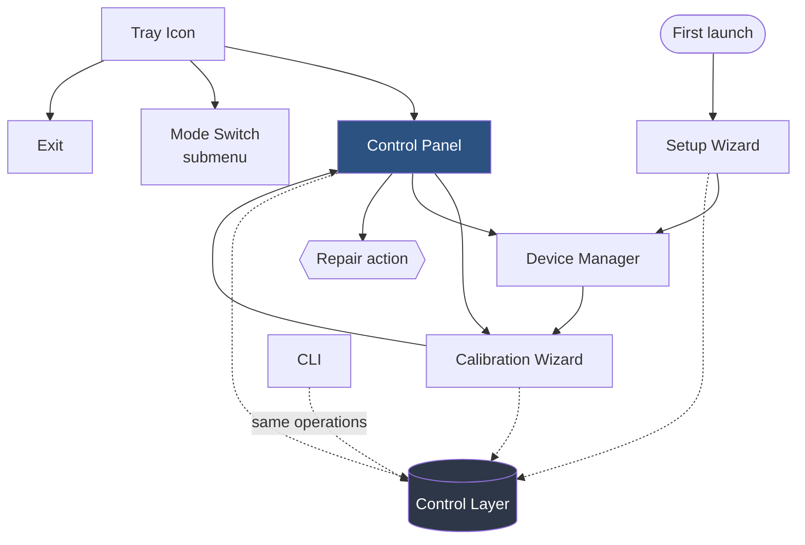
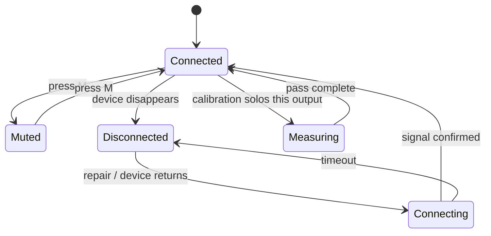
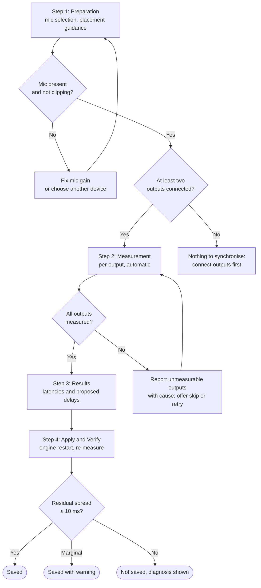
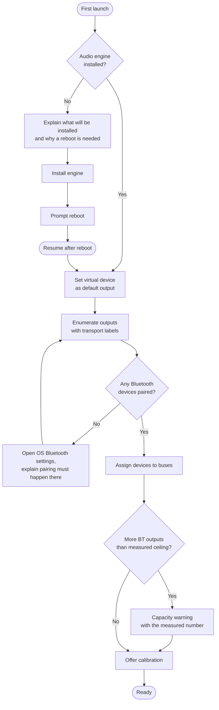

# Chorus: UI Flow Specification

| Field | Value |
|---|---|
| Document | UI Flow |
| Product | Chorus: Multi-Output Synchronised Audio Hub |
| Version | 0.1.0 (Draft) |
| Status | In development |
| Last updated | 2026-08-25 |
| Companion documents | [PRD](PRD.md) · [TRD](TRD.md) · [Schema](SCHEMA.md) · [User Manual](USER-MANUAL.md) |

---

## 1. Design Principles

| # | Principle | Consequence |
|---|---|---|
| P1 | **The common case is one control.** Ninety percent of use is "make it louder" or "make it quieter". | Master volume is always reachable without navigating anywhere. |
| P2 | **Never claim success that was not verified.** | Every action that writes to the audio engine reports only after readback confirmation, and shows a distinct pending state while doing so. |
| P3 | **Degraded is normal, not an error.** Wireless outputs drop; that is the medium, not a bug. | A missing speaker is shown as a state on the affected row, never as a modal dialog. |
| P4 | **Numbers, not adjectives.** | Latency is shown in milliseconds, gain in dB, spread as a measured figure. No "good/poor" without the number beside it. |
| P5 | **The GUI is a view, the CLI is the API.** | Everything the panel does is a CLI call underneath; no capability is GUI-only. |

---

## 2. Surface Inventory

| Surface | Purpose | Lifetime | Priority |
|---|---|---|---|
| **Control Panel** | Volume, mute, per-output level, live status | Always-on-top window, autostarts with host | M |
| **Tray Icon** | Reach the panel, quick mode switch, status at a glance | Persistent | S |
| **Calibration Wizard** | Guided measurement and delay application | Modal, task-scoped | M |
| **Setup Wizard** | First-run: engine install, device assignment | Runs once | M |
| **CLI** | Full functionality, automation surface | Invoked per command | M |



---

## 3. Control Panel

The primary surface. Always-on-top, minimisable to taskbar and tray, autostarts with the host.

### 3.1 Layout

```
┌─ Chorus ───────────────────────────────── ─ □ ✕ ┐
│                                                  │
│  ALL          ▓▓▓▓▓▓▓▓▓▓▓▓▓▓░░░░░░   -6 dB  [M] │
│  ──────────────────────────────────────────────  │
│  PartyPal 185 ▓▓▓▓▓▓▓▓▓▓░░░░░░░░░░  -12 dB  [M] │
│   ●  BT · 42 ms delay                    ▮▮▮▯▯  │
│                                                  │
│  Stone 1400   ▓▓▓▓▓▓▓▓▓▓▓▓▓▓▓▓░░░░   -3 dB  [M] │
│   ●  BT · 0 ms delay                     ▮▮▮▮▯  │
│                                                  │
│  Tab S9 FE+   ▓▓▓▓▓▓▓▓▓▓▓▓░░░░░░░░   -8 dB  [M] │
│   ○  Miracast · not connected            ▯▯▯▯▯  │
│                                                  │
│  ──────────────────────────────────────────────  │
│  Synced within 6 ms          [Calibrate] [Fix]  │
└──────────────────────────────────────────────────┘
```

### 3.2 Element specification

| Element | Type | Behaviour | Range |
|---|---|---|---|
| Master slider (`ALL`) | Horizontal slider | Sets source strip gain; scales every output together | −40 … +6 dB |
| Output slider | Horizontal slider | Sets that output's bus gain only | −40 … +6 dB |
| dB readout | Label | Live value, updates during drag | Integer dB |
| `[M]` | Toggle button | Mutes that output without altering gain; red fill when engaged | on/off |
| Status dot | Indicator | ● connected · ○ disconnected · ◐ connecting | 3 states |
| Status line | Label | `<transport> · <delay> ms delay`, or the disconnect reason | text |
| Level meter (`▮▮▮▯▯`) | Meter | Live output level, confirms signal is actually reaching the device | 5 segments |
| Sync summary | Label | Residual spread from the last calibration, or `Not calibrated` | text |
| `[Calibrate]` | Button | Opens the Calibration Wizard | n/a |
| `[Fix]` | Button | Runs repair; enabled only when an output is Orphaned | n/a |

The level meter earns its place: it is the only element that distinguishes "the app thinks this output is fine" from "sound is genuinely arriving at the device". During development, that distinction was repeatedly the difference between a real fault and a phantom one.

### 3.3 Row states



| State | Dot | Slider | Status line |
|---|---|---|---|
| Connected | ● green | Enabled | `BT · 42 ms delay` |
| Muted | ● green | Enabled, `[M]` red | `BT · muted` |
| Disconnected | ○ grey | Disabled, dimmed | `Miracast · not connected` |
| Connecting | ◐ amber | Disabled | `Reconnecting…` |
| Measuring | ● blue | Disabled | `Measuring…` |

### 3.4 Interaction rules

1. **Master and per-output gains are independent.** The master scales the source; per-output gains trim relative balance. Moving the master never rewrites the individual values.
2. **A disconnected row keeps its settings.** Gain, mute and delay persist so that reconnection restores the previous balance.
3. **`[Fix]` is enabled only when it can do something.** Greyed out when no output is Orphaned, preventing pointless engine restarts.
4. **Writes show pending state.** A control that has issued an engine write but not yet confirmed readback shows a subtle pending indicator; on failure the control reverts to its previous value and surfaces an inline message (P2).

---

## 4. Calibration Wizard

The flagship flow. Four steps, each with an explicit precondition check.



### 4.1 Step 1: Preparation

```
┌─ Calibrate: Step 1 of 4 ────────────────────────┐
│                                                  │
│  Microphone                                      │
│  ┌────────────────────────────────────────────┐  │
│  │ Microphone (Realtek High Definition Audio)▾│  │
│  └────────────────────────────────────────────┘  │
│  Input level   ▮▮▮▮▮▮▮▯▯▯   good                │
│                                                  │
│  Placement                                       │
│  Put the microphone roughly the same distance    │
│  from every speaker. The laptop between them     │
│  is usually fine.                                │
│                                                  │
│      ┌───┐        ┌─────┐        ┌───┐           │
│      │ 🔊│ ~2m    │  🎤 │   ~2m  │🔊 │           │
│      └───┘        └─────┘        └───┘           │
│                                                  │
│  Outputs to calibrate                            │
│  ☑ PartyPal 185      ● connected                 │
│  ☑ Stone 1400        ● connected                 │
│  ☐ Tab S9 FE+        ○ not connected             │
│                                                  │
│  This takes about 30 seconds per speaker and     │
│  will play a clicking sound.                     │
│                                                  │
│                        [Cancel]  [Start ▸]       │
└──────────────────────────────────────────────────┘
```

Behaviour:
- Input level meter runs live; `[Start]` is disabled while the level reads `clipping` or `silent`.
- Disconnected outputs are shown but unchecked and unselectable, so the user sees why they are excluded.
- The duration and the audible-clicking warning are stated up front, because an unexplained clicking noise reads as a malfunction.

### 4.2 Step 2: Measurement

```
┌─ Calibrate: Step 2 of 4 ────────────────────────┐
│                                                  │
│  Measuring PartyPal 185…                         │
│                                                  │
│  ▓▓▓▓▓▓▓▓▓▓▓▓▓▓▓▓▓▓░░░░░░░░░░░░   1 of 2        │
│                                                  │
│  Captured onsets                                 │
│  ▮   ▮   ▮   ▮   ▮   ▮   ▮   ▮                  │
│  └─── 8 of 8 detected, phase stable ───┘         │
│                                                  │
│  Only this speaker is playing right now.         │
│  Please keep the room quiet.                     │
│                                                  │
│                                    [Cancel]      │
└──────────────────────────────────────────────────┘
```

Behaviour:
- Outputs are soloed in sequence; the currently measured output is named explicitly.
- Detected onsets appear live. This is deliberate: a user watching zero onsets appear learns immediately that the speaker is not audible, rather than waiting for a failure at the end.
- Phase stability is reported qualitatively beside the count, backed by the numeric IQR in the results step.

### 4.3 Step 3: Results

```
┌─ Calibrate: Step 3 of 4 ────────────────────────┐
│                                                  │
│  Measured latency                                │
│                                                  │
│  Stone 1400     ████████████████████  218 ms     │
│  PartyPal 185   ███████████████░░░░░  176 ms     │
│                                    ↑             │
│                          42 ms apart, audible   │
│                                                  │
│  Proposed correction                             │
│  ┌──────────────────────────────────────────┐    │
│  │ Stone 1400     0 ms   (slowest, anchor) │    │
│  │ PartyPal 185  +42 ms                     │    │
│  └──────────────────────────────────────────┘    │
│                                                  │
│  Applying this needs a short audio restart.      │
│                                                  │
│                    [◂ Back]  [Apply ▸]           │
└──────────────────────────────────────────────────┘
```

Behaviour:
- Absolute latencies are shown, not only the difference, so the user can see that Bluetooth is inherently slow and that Chorus is not claiming to fix that.
- The anchor output is labelled as such, explaining why it receives no delay. This pre-empts "why did it only change one speaker?"
- The audio interruption is disclosed before it happens.

### 4.4 Step 4: Apply and Verify

```
┌─ Calibrate: Step 4 of 4 ────────────────────────┐
│                                                  │
│  ✓ Delays written and verified                   │
│  ✓ Audio engine restarted                        │
│  ✓ Outputs re-connected                          │
│  ✓ Verification pass complete                    │
│                                                  │
│  ┌──────────────────────────────────────────┐    │
│  │  Synced within 6 ms                      │    │
│  │  Below the 10 ms audible threshold.      │    │
│  └──────────────────────────────────────────┘    │
│                                                  │
│  Saved as profile "living-room".                 │
│                                                  │
│                                     [Done]       │
└──────────────────────────────────────────────────┘
```

The checklist mirrors the real sequence from TRD §5.4, including the re-connection step that exists because engine restarts drop bus assignments. Showing it builds justified confidence: each line is a verified fact, not a progress animation.

### 4.5 Failure presentation

```
┌─ Calibrate, Could not complete ─────────────────┐
│                                                  │
│  Stone 1400: no sound detected                  │
│                                                  │
│  The measurement heard nothing from this          │
│  speaker. Likely causes:                          │
│                                                  │
│   • Speaker volume set very low                  │
│   • Speaker too far from the microphone          │
│   • Speaker connected but not playing            │
│     (level meter shows no signal)                │
│                                                  │
│  PartyPal 185 measured fine at 176 ms.           │
│                                                  │
│  Nothing was changed.                            │
│                                                  │
│              [Retry]  [Skip this output]  [Close]│
└──────────────────────────────────────────────────┘
```

Rules for failure screens:
- Name the specific output and the specific symptom.
- List causes in descending order of likelihood, drawn from the observed failure modes (TRD §8).
- State explicitly what *did* succeed, so the user knows the scope of the problem.
- State explicitly that nothing was changed. A failed calibration must never leave partial delays applied.

---

## 5. Setup Wizard (first run)



Pairing deliberately delegates to the operating system rather than reimplementing a Bluetooth pairing UI: the OS flow is more reliable, already familiar, and handles PINs and device quirks.

---

## 6. Tray Icon

| Element | Behaviour |
|---|---|
| Icon | Reflects session state: Ready (normal), Degraded (badge), Calibrating (animated) |
| Left click | Show/hide Control Panel |
| Right click | Context menu |
| Tooltip | `Chorus: 2 of 3 outputs active` |

```
┌──────────────────────────┐
│  Show Control Panel      │
│  ──────────────────────  │
│  Mode ▸  ● Theatre (all) │
│          ○ PartyPal only │
│          ○ Stone only    │
│          ○ Laptop only   │
│  ──────────────────────  │
│  Calibrate…              │
│  Fix outputs             │
│  ──────────────────────  │
│  Exit                    │
└──────────────────────────┘
```

---

## 7. CLI Surface

The CLI is the complete API; the GUI is a client of it (P5).

| Command | Purpose | Output |
|---|---|---|
| `chorus status` | Session state, per-bus device, transport, signal, delay | Table |
| `chorus devices [--scan]` | Available outputs with transport type | Table |
| `chorus assign <bus> <device>` | Assign device to bus | Confirmation, verified |
| `chorus route <bus> on\|off` | Enable/disable routing | Confirmation |
| `chorus gain <bus> <db>` | Set bus gain | Confirmation |
| `chorus mute <bus> on\|off` | Mute a bus | Confirmation |
| `chorus mode <name>` | Switch output mode | Confirmation |
| `chorus calibrate [--profile <name>] [--mic <device>]` | Run calibration | Progress + result table |
| `chorus delay <bus> <ms>` | Manually override delay | Confirmation, verified |
| `chorus repair` | Re-assert assignments, restart engine | Per-bus result |
| `chorus diagnose` | Transport, contention, stream count report | Report |
| `chorus config show\|edit\|validate` | Config management | JSON / validation result |

Example output:

```
$ chorus status

Session: Ready                     Profile: living-room
Engine:  Voicemeeter Potato 3.1.2.2   Buffer: 1024 (WDM)

BUS  DEVICE            TRANSPORT   ROUTE  GAIN    DELAY  SIGNAL
A1   PartyPal 185      BT A2DP     on     -12 dB   42 ms  ▮▮▮▯▯
A2   Stone 1400        BT A2DP     on      -3 dB    0 ms  ▮▮▮▮▯
A3   Tab S9 FE+        Miracast    on      -8 dB, ms  ─────  orphaned

Last calibration: 2026-08-25 18:04   residual spread 6 ms   PASS
```

Conventions:
- Exit code `0` success, `1` user error, `2` engine/verification failure, `3` calibration failure.
- `--json` on any command emits machine-readable output for automation.
- Every mutating command prints the verified post-state, never merely "OK".

---

## 8. Feedback and Messaging

| Situation | Surface | Pattern |
|---|---|---|
| Output dropped | Panel row + tray badge | Passive state change; no modal |
| Calibration finished | Wizard step 4 | Numeric result with threshold comparison |
| Engine write failed | Inline at the control | Control reverts; message names the parameter |
| Capacity warning | Assignment step | States the measured ceiling and that exceeding it is untested |
| Nothing to do | Disabled control + tooltip | Explain *why* it is disabled |

**Prohibited patterns:** modal dialogs for routine wireless drops; progress bars that do not reflect real progress; success messages issued before readback verification; and any adjective about audio quality unaccompanied by the measured number (P4).

---

## 9. Accessibility and Ergonomics

| Requirement | Implementation |
|---|---|
| Keyboard operable | Tab order follows visual order; sliders respond to arrow keys (±1 dB) and Page Up/Down (±5 dB) |
| Not colour-dependent | Status uses shape (●/○/◐) plus text, not colour alone |
| Readable at high DPI | Layout uses relative units; verified at 250% scaling, the reference platform runs at 250% |
| Screen-reader labels | Every control carries an accessible name including its current value |
| Minimum target size | 32 × 32 px for buttons |

The high-DPI requirement is specific and non-negotiable: the reference platform runs at 250% scaling, and an earlier attempt to enlarge a fixed-size third-party window by DPI-stretch produced a window larger than the screen. The panel must scale natively rather than being stretched.

---

## 10. Deferred UI Work

| Item | Reason deferred |
|---|---|
| Per-output equalisation | Out of scope for v1 (PRD W-3) |
| Visual room layout editor with distances | Depends on distance compensation (FR-2.8, v0.3) |
| Calibration history graph | Needs logging (FR-4.3) to accumulate data first |
| Drag-and-drop bus assignment | Text assignment is sufficient and scriptable |
| Dark/light theming | Follow OS default initially |
