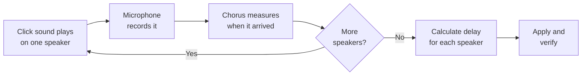

# Chorus: User Manual

| Field | Value |
|---|---|
| Document | User Manual |
| Product | Chorus: Multi-Output Synchronised Audio Hub |
| Version | 0.1.0 (Draft) |
| Last updated | 2026-08-25 |
| Companion documents | [PRD](PRD.md) · [TRD](TRD.md) · [UI Flow](UI-FLOW.md) · [Schema](SCHEMA.md) |

---

## 1. What Chorus Does

Chorus plays sound from your PC through several speakers at once: Bluetooth speakers, a tablet used as a wireless display, HDMI, or the laptop's own speakers. It then **measures the timing difference between them with a microphone and corrects it automatically**.

Without that correction, two Bluetooth speakers playing together sound like an echo, because each one adds its own delay and the delays never match.

### What Chorus does not do

Please read this part before installing. It will save you disappointment.

| Chorus does not | Why |
|---|---|
| Make Bluetooth audio low-latency | Bluetooth adds 150-250 ms. That is the technology, not a setting. Chorus makes all your speakers *equally* late, which is what stops the echo. |
| Give you true surround sound (5.1/7.1) | Every speaker plays the same stereo programme. Real surround needs an AV receiver over HDMI. |
| Connect more Bluetooth speakers than your adapter supports | Windows uses **one** Bluetooth radio and that radio has a bandwidth limit. See §9.1. |
| Improve audio quality | Bluetooth SBC is lossy. Chorus fixes *timing*, not fidelity. |
| Work with your speakers linked to each other | Chorus talks to each speaker independently. Turn off any TWS/PartyBoost pairing between them. |

---

## 2. Before You Start

### 2.1 You need

- Windows 10 or 11
- Two or more audio outputs (Bluetooth speakers, tablet, HDMI, or built-in speakers)
- A microphone. The laptop's built-in mic is usually adequate
- About 15 minutes

### 2.2 How many Bluetooth speakers?

Be realistic here, because this is the most common disappointment.

Windows uses **one Bluetooth radio at a time**, and plugging in USB Bluetooth dongles does not add capacity. Windows will not use them simultaneously. That one radio has to carry every speaker's audio stream, and each stream needs roughly 345 kbps.

**On the reference hardware (Intel Wireless-AC 8260), two Bluetooth speakers work reliably.** Three or more has not yet been verified. If you try more, Chorus will let you, but it will warn you, and you should expect dropouts.

You can go past that limit by mixing transports, for example two Bluetooth speakers plus a tablet on Miracast plus HDMI, because those use different radios and connections.

---

## 3. Installation

```bash
git clone https://github.com/<your-username>/chorus.git
cd chorus
.\install.ps1
```

The installer will:

1. Check for the audio engine (Voicemeeter Potato) and install it if missing
2. Ask you to **reboot**. This is required for the virtual audio driver
3. Set the virtual audio device as your default output
4. Disable Windows power-saving on your Bluetooth and Wi-Fi adapters (this prevents a common cause of dropouts)
5. Add Chorus to startup

> **The reboot is not optional.** The virtual audio driver only loads properly after a restart.

---

## 4. First Setup

### Step 1: Connect your speakers first

Turn on every speaker you want to use and make sure Windows shows them as **Connected** in Settings → Bluetooth & devices.

> Chorus can only see speakers that are switched on and connected. A speaker that is merely *paired* but switched off will not appear.

### Step 2: Run setup

```bash
chorus setup
```

You will see a list like this:

```
BUS  AVAILABLE DEVICES                          TRANSPORT
  1  Headphones (PartyPal 185 Stereo)           BT A2DP
  2  Headphones (boAt Stone 1400 Stereo)        BT A2DP
  3  Digital Output (Abhishek's Tab S9 FE+)     Miracast
  4  Speakers (Realtek High Definition Audio)   Analog
```

Choose which devices go on which output bus.

> **Always pick the "Stereo" version of a Bluetooth device, never "Hands-Free".** Hands-free is the telephone-quality mono mode. Chorus hides these automatically, but if you assign devices by hand, watch for it.

### Step 3: Calibrate

```bash
chorus calibrate
```

This is the important step. See §6.

---

## 5. Everyday Use

Once set up, the routine is:

1. **Turn on your speakers.** They reconnect automatically.
2. **Play something.** That is all.

Chorus and the audio engine start with Windows and restore your settings.

If one speaker is silent, run:

```bash
chorus repair
```

That re-connects the outputs and restarts the audio engine. It takes about fifteen seconds and fixes the large majority of morning-after problems.

---

## 6. Calibration: Getting Rid of the Echo

### 6.1 When to calibrate

- The first time you set up
- Whenever you add or replace a speaker
- Whenever playback develops an echo it did not have before
- After changing the buffer size

### 6.2 How to do it

1. Place your microphone (or the laptop) **roughly the same distance from each speaker**. This matters, sound travels about 1 metre every 3 milliseconds, so a badly placed mic produces badly calculated delays.
2. Make the room quiet.
3. Run `chorus calibrate`.
4. Wait. You will hear a clicking sound from one speaker at a time. This is expected. It is the measurement signal.

### 6.3 What happens



### 6.4 Reading the result

```
Measured latency
  Stone 1400      218 ms
  PartyPal 185    176 ms
                  ── 42 ms apart, audible as an echo

Applied correction
  Stone 1400        0 ms   (slowest, everything else waits for it)
  PartyPal 185    +42 ms

Verification: synced within 6 ms  ✓ PASS
```

**Why does only one speaker get a delay?** Because delay can only be *added*, never removed. The slowest speaker sets the pace, and every faster speaker is held back to match it.

**What counts as good?**

| Result | Meaning |
|---|---|
| Within 10 ms | Correct. You will hear one sound. |
| 10-25 ms | Acceptable. Slight widening, usually unnoticeable. |
| Over 25 ms | Something went wrong, see §9.5. |

---

## 7. Modes: Choosing Where Sound Goes

Modes switch the whole system between output setups with one command.

```bash
chorus mode theatre     # all speakers together, through the hub
chorus mode partypal    # PartyPal only
chorus mode stone       # Stone 1400 only
chorus mode laptop      # laptop's own speakers
```

**Single-speaker modes bypass the hub entirely,** pointing Windows straight at that one device. They work even when the audio engine is not running.

> If sound is coming from an unexpected place, it is almost always because the mode is not what you assumed. `chorus status` will tell you.

---

## 8. Volume Control

The Chorus panel starts with Windows and sits in the tray.

| Control | Effect |
|---|---|
| **ALL** slider | Everything together, your everyday volume |
| Per-speaker slider | That speaker only, use it to balance a loud speaker against a quiet one |
| **M** button | Mutes one speaker without losing its volume setting |

**Balancing tip:** if one speaker overpowers the others, pull *it* down rather than pushing the others up. Boosting above 0 dB can distort.

> Your keyboard volume keys may not affect Chorus, because they control the Windows device rather than the hub. Use the panel's **ALL** slider instead.

---

## 9. Troubleshooting

### 9.1 Dropouts: sound cuts out briefly, then returns

This is the most common problem, and it is nearly always **radio congestion**, not a Chorus fault. Bluetooth and 2.4 GHz Wi-Fi share the same airwaves and, on most laptops, the same antenna.

Work through these in order:

| # | Check | Why |
|---|---|---|
| 1 | **Is a tablet or TV connected as a wireless display?** Disconnect it and test. | Miracast streams video over the same band and is by far the biggest offender. On the reference system this alone caused the dropouts. |
| 2 | **Is your Wi-Fi on 2.4 GHz?** Switch the router to 5 GHz and connect the PC to it. | This is the single most effective fix. It clears the band for Bluetooth. |
| 3 | **Increase the buffer.** `chorus config set engine.buffers.mme 2048` | A bigger buffer rides through brief interference. Costs latency you will not notice. |
| 4 | **Switch to MME.** `chorus config set engine.preferred_interface mme` | MME buffers more deeply than WDM and tolerates interference better. |
| 5 | **Move speakers closer,** within about 3 m, with clear line of sight. | Weak signal means more retransmissions. |
| 6 | **Turn off unused Bluetooth gadgets**, earbuds in their case, smartwatches, controllers. | Each one keeps a background connection on the same radio. |
| 7 | **Reduce the number of Bluetooth speakers.** | If you are running more than two, you are past verified capacity. |

> If dropouts vanish when you switch Wi-Fi off entirely, you have confirmed it is band congestion, and step 2 is your real fix.

### 9.2 One speaker is silent

```bash
chorus repair
```

If that fails:

1. Confirm the speaker is powered on and shows **Connected** in Windows Bluetooth settings.
2. Power-cycle the speaker, wait for it to reconnect, then run `chorus repair` again.
3. Check `chorus status`, if the bus shows `orphaned`, Windows has lost the device, not Chorus.

> This happens most often after a reboot, because Bluetooth reconnects more slowly than Chorus starts. It is expected, and `repair` is the intended remedy.

### 9.3 No sound at all

| Check | Command / action |
|---|---|
| Is the audio engine running? | `chorus status`, should report an engine version |
| Is Windows pointed at the hub? | `chorus mode theatre` re-asserts it |
| Are the speakers actually on? | Windows Bluetooth settings should say Connected |
| Did another app steal the default device? | `chorus repair` |

### 9.4 Sound plays from the wrong device

Check the current mode with `chorus status`. Windows plays to exactly one default device at a time; single-speaker modes point it directly at that speaker, and `theatre` mode points it at the hub.

### 9.5 Calibration fails or gives a bad result

| Symptom | Cause | Fix |
|---|---|---|
| "No sound detected" for one speaker | Speaker too quiet, too far, or not actually playing | Raise its volume, move the mic closer, confirm the level meter shows signal |
| "Unstable measurement" | Transport dropping packets during the test | Fix dropouts first (§9.1), then recalibrate |
| Result over 25 ms | Usually unequal mic distance | Re-place the mic equidistant from all speakers and retry |
| "Microphone clipping" | Mic gain too high | Lower the microphone level in Windows sound settings |
| Sounds wrong despite a PASS | Mic was much closer to one speaker | Re-place and recalibrate |

> A failed calibration changes nothing. Your previous settings are left intact.

### 9.6 Echo came back after it was fine

Something changed the transport latency. Usual causes: a speaker reconnected with a different codec, the buffer size changed, or a speaker was replaced. Run `chorus calibrate` again.

### 9.7 The audio engine window is enormous or off-screen

If you opened Voicemeeter directly and it fills the screen, a DPI compatibility override has been applied to it. Remove it:

Right-click `voicemeeter8x64.exe` → Properties → Compatibility → **Change high DPI settings** → untick the override.

> You should rarely need the engine window. Use the Chorus panel for daily control.

### 9.8 Speakers do not appear in the device list

1. The speaker must be **switched on and connected**, not merely paired.
2. If it appears only as "Hands-Free", disconnect and reconnect it. Windows sometimes attaches in call mode. Chorus deliberately hides hands-free endpoints because they are mono and telephone-quality.
3. Some speakers need to be un-paired and re-paired after being used with a phone.

---

## 10. FAQ

**Can I use more than two Bluetooth speakers?**
Maybe. Two is verified on the reference hardware; more is untested. Chorus permits it with a warning. If you try it, please open an issue with your adapter model and results. That data is exactly what the project needs.

**Why not just use USB Bluetooth dongles?**
Windows only uses one Bluetooth adapter at a time. Extra dongles will not be used simultaneously. Linux (BlueZ) can address multiple adapters independently, which is the path to more speakers, and is on the roadmap.

**Will this work on Linux or macOS?**
Not yet. Windows only for v1. The calibration approach is OS-agnostic and a Linux backend is planned.

**Does it work with any Bluetooth speaker?**
Yes. Chorus talks to each speaker independently, so brand and model do not need to match. That is the whole point.

**Does lip-sync break when watching video?**
Browsers and most video players compensate automatically. In VLC, `j` and `k` adjust audio delay if needed.

**Can I use my phone as a speaker?**
Not over Bluetooth. A tablet or phone connected as a *wireless display* (Miracast) can act as an output, but be aware it is the heaviest user of the 2.4 GHz band and the most likely cause of dropouts.

**Is the delay setting permanent?**
Yes. It is saved and restored across reboots. Re-run calibration if your setup changes.

---

## 11. Glossary

| Term | Meaning |
|---|---|
| **A2DP** | The Bluetooth profile for stereo music. What you want. |
| **HFP / Hands-Free** | The Bluetooth profile for phone calls. Mono, low quality. Avoid for playback. |
| **Bus** | One output channel in Chorus. Each bus drives one device. |
| **Latency** | How long sound takes to travel from PC to speaker. |
| **Residual spread** | The remaining difference between your fastest and slowest speaker after correction. Lower is better; under 10 ms is inaudible. |
| **Anchor** | The slowest speaker. Everything else is delayed to match it. |
| **Miracast** | Wireless display technology. Carries audio too, over Wi-Fi rather than Bluetooth. |
| **Buffer** | How much audio the engine holds in reserve. Bigger means more resistant to dropouts but more latency. |
| **Orphaned** | A bus whose device has disappeared, usually a speaker that was switched off. |

---

## 12. Getting Help

When opening an issue, please include:

```bash
chorus diagnose --bundle
```

This produces a zip containing your configuration, logs, and device inventory. It contains **no personal data and no credentials**.

Please also state:
- Your Bluetooth adapter model (`chorus diagnose` reports it)
- How many speakers, and their transports
- Whether Wi-Fi is 2.4 GHz or 5 GHz
- Whether any wireless display is connected
